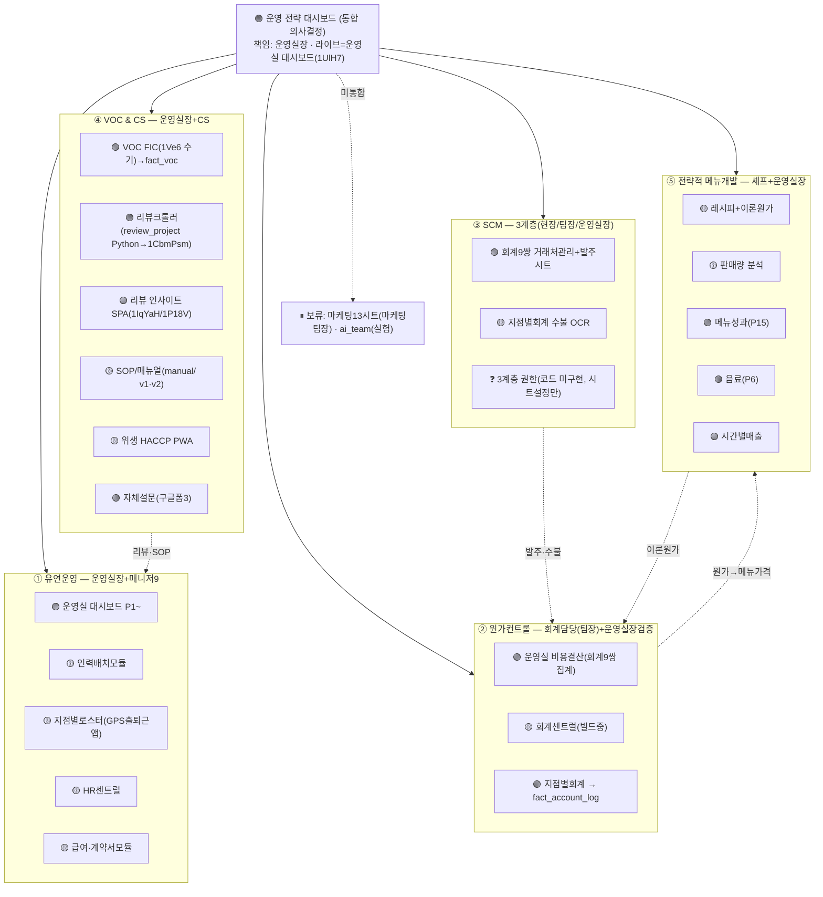

# CLAUDE LEARNING LOG — 운영실장 시스템 line-level 인벤토리

> 목적: 대화 모델 Claude가 운영실장(운영실장)의 전사 운영 시스템을 정확히 이해하도록, 클로드 코드가 **코드·시트에서 직접 추출**한 line-level 인벤토리 + 데이터 흐름 + 운영 시나리오를 **누적**한다.
> 사용법(대화 Claude): 이 파일을 web_fetch로 읽고, ❓ 항목은 운영실장에게 질문, ⚠ 항목은 검증 요청.
> 누적 규칙: 덮어쓰지 않고 Day N 섹션 append. 정정은 해당 항목에 `[정정 Day N]` 표기.

## 범례 (모든 항목 필수 마킹)
- ✅ **확인**: 코드/시트/DB에서 직접 읽음
- ⚠ **추측**: 코드/데이터 + 추론 (운영실장 검증 필요)
- ❓ **질문**: 코드/데이터에 없음 — 운영실장 답 필요

---

# 16-노드 매핑표 (재구성 — PDF 미접근, ⚠/❓)

❓ **Q0. "PDF OS 구조도"가 작업환경에 안 들어왔습니다.** Drive 검색(구조/OS/아키텍처+pdf)에도 없음. → PDF를 Drive에 업로드하거나 **16개 노드 이름 목록**을 주시면 아래 재구성과 1:1 대조하겠습니다. 지금은 작업지시서 a~i 분류 + 기존 인벤토리(MASTER_PLAN/SYSTEM_INVENTORY/SCRIPT_IDS)로 재구성.

| 그룹 | 노드(시스템) | Apps Script ID | 핵심 시트 ID | 상태 | 담당(추정) |
|---|---|---|---|---|---|
| a | 운영실 대시보드 (P1~P19 + KPI Snapshot) | `1UlH7sYMBcUf…`(18파일) ✅ | BI통합 `1tKr70…` ✅ | 🟢 라이브(06-22 수정) ✅ | 운영실장 ⚠ |
| b | VOC + 리뷰 인사이트 | VOC주간 `1yLUyT…`(95줄)✅ / 리뷰 `1IqYaH…`(5파일)✅ / FIC본체 `1P18V…` ❓미확보 | VOC SZI `1Ve6…`✅ CON `1RL…`✅ / 리뷰소스 `1CbmPsm…` ⚠ | VOC sync 🟢(19,769행) / 리뷰 ❌미이주 | 운영실장/CS ⚠ |
| c | 회계 센트럴 + 지점별 회계 | CON센트럴 v5.2 `bwyu-1`(3)✅ / SZI v4 `bwyu-5`(1)✅ / 지점 푸드코스트 v4.2 `bwyu-3`(4)✅ | 9 회계시트 ✅ | 추적로그 🟢(8,090행) / 센트럴 ❌ | 회계담당(회계담당) ✅(코드주석) |
| d | HR센트럴 + 지점로스터 + 급여계약 | HR `1hEq11…`(7)✅ / 로스터 `1VD6p0p…`(18,5886줄)✅ | HR 2시트 / 로스터 18시트 ✅ | ❌미이주 | HR/회계담당 ⚠ |
| e | 매출대시보드 + 지점OP + 시간별 | (a 대시보드가 렌더) | 9 OP시트 ✅ + BI `1tKr70…` | 🟢 fact_sales_daily 820행+7신규컬럼 ✅ | 매장매니저 입력 ✅ |
| f | 운영실 비용결산 + 인력배치 | ❓미식별 | ❓ | ❓ | 운영실장 ⚠ |
| g | 위생 HACCP PWA + SOP + 매뉴얼 | 위생 `1URkxkZb…`(24)✅ / 매뉴얼 `1PSQGdGZ…`(2)✅ / 라운드3 `1QwUURch…`(9)✅ | 매뉴얼 `1apm9eR9…`✅ | ❌미이주 | 매니저/운영실장 ⚠ |
| h | 레시피+이론원가 + 판매량 | 판매량 `1HbgElbaivhU…`(17)✅ | 판매량 `1Gf2POwr…`✅ | ❌미이주 | 셰프/회계 ⚠ |
| i | 마케팅 13시트 | (마케팅 BI 설계 `1ll3vT…`) ⚠ | 13시트(KPI/META/카카오/시딩/CRM/상위노출)✅ | ❌미이주 | 마케팅팀장 ⚠ |

❓ **Q1. 노드 f(운영실 비용결산 + 인력배치 모듈)** — 별도 Apps Script/시트가 있나요? 코드/Drive에서 아직 못 찾음. scriptId 또는 시트 ID 알려주세요.
❓ **Q2. VOC FIC 본체(`1P18V_JfgbTG…`, MASTER_PLAN상 6파일)** — 현재 VOC 시트엔 95줄 Slack 스크립트만 바운드. 이 6파일 본체는 폐기됐나요, 아니면 별도 위치인가요?

---

# Day 1 — 노드 a: 운영실 대시보드 (P1 line-level)

## a-1. 시스템 개요 ✅
- scriptId `1UlH7sYMBcUfTOap72kcaODkPv7zW8gbBVkD3_0Oww1Q55uN4JPq4ZBfk` (clasp clone 완료) ✅
- 성격: **HTML 단일 페이지 BI 출력** (Apps Script 웹앱 + Drive 캐시). 25 챕터 + Chart.js 다수. ✅
- 파일 18개 ✅: `Code.js`(22,014줄, ctx 빌더+라우팅+sync+AI) / 렌더챕터 `gd_p1_overall`(707)·`ge_p5~p10`(945)·`gb_p11_reviews`(463)·`gc_p13_scorecard`(390)·`gf_p18~m12`(1910)·`gh_m0~m9_marketing`(1544)·`gi_exec_summary`(160)·`ga_render_helpers`(74) / 브리지(Supabase) `bridge_a_sync_sales`·`bridge_a_sync_accounting`·`bridge_c_sync_voc_haccp_discount`·`bridge_z_helpers`·`bc_sync_helpers`·`be_sync_op`·`bf_sync_monthly` / `bb_health`·`bd_triggers`
- ⚠ **챕터→파일 매핑**(파일명 기준): P1=gd / P5~P10=ge / P11=gb / P13=gc / P18·M12=gf / M0~M9=gh / ExecSummary=gi. **P2·P3·P4·P7·P8·P9·P14·P15·P19·P20·P21은 어느 파일인지 ❓** (Code.js 내부 또는 미식별 — Day 1 범위 밖, 추후 확인)

## a-2. 데이터 흐름 ✅ (코드 확인)
```mermaid
flowchart LR
  OP["9 OP 시트<br/>(매장 매니저 매일 입력)"] -->|syncOpData| BI["BI 통합시트 1tKr70<br/>매출_일별 27컬럼"]
  ACC["9 회계 시트<br/>(추적로그)"] -->|syncMonthlyData| BI
  BI -->|"_renderChapterP1 등<br/>(ctx 빌더가 BI read)"| DASH["운영실 대시보드<br/>HTML 출력 + Drive 캐시 3벌"]
  BI -->|"bridge_a_sync_sales<br/>(매시간)"| SUPA[("Supabase<br/>fact_sales_daily")]
  ACC -->|bridge_a_sync_accounting| SUPA2[("fact_account_log")]
  OP -->|bridge_c (할인/VOC)| SUPA3[("fact_discount / fact_voc")]
  DASH -->|매일 06:30 캐시 / 13:00 syncAll 후 재캐시| USER["CEO · 운영실장<br/>(매일 아침 5분)"]
```
- ✅ 대시보드 렌더는 **BI 통합시트(`1tKr70`)를 ctx로 읽음** (Supabase 아님). Supabase는 **별도 신규 시스템**(우리가 구축 중)이 같은 BI를 브리지로 받는 것.
- ✅ 캐시: 매일 06:30 자동 + 13:00 syncAll 후 재캐시 (P1 methodology 명시).

## a-3. P1 "전사 통합" 챕터 — 14섹션 인벤토리 ✅ (gd_render_chapter_p1_overall.js 707줄 전부 정독)

| # | 섹션 | 유형 | 줄 | 데이터(ctx) | 마크 |
|---|---|---|---|---|---|
| 0 | 방법론 헤더 | doc | 40–49 | — | ✅ |
| 1 | KPI Row 6개 | KPI | 54–92 | c.last7Rev·c.wow·c.revM·c.targetM·c.pace·c.ach·c.cust·c.ticket·c.anomalyCount / 신규월1~3일 swap | ✅render ⚠calc(Code.js) |
| 2 | 시스템 health 배지 | card | 95–134 | ctx.freshness·ctx.triggerHealth | ✅ |
| 3 | 데이터 무결성 검증 | table | 137–162 | ctx.전사.dataIntegrity (A~H 7검증, 09:25) | ✅render ⚠검증로직 |
| 4 | 같은 요일 비교 | table | 164–231 | ctx.전사.wowByDay/last7ByDay/prev7ByDay (런치·디너 WoW) | ✅render ⚠calc |
| 5 | 지점별 일별 매출 9×7 | table | 233–297 | loc.last7ByDay | ✅ |
| 6 | 오늘의 안건 Top3 | table | 299–385 | 자동 4룰(매출위기-15%/비용임계+5%p/부정리뷰3건&30%/진척<80%) | ✅ |
| 7 | 매출 위기 자동감지 | table | 387–421 | 직전7일 일평균 vs 전월 -15%↓ | ✅ |
| 8 | 매장 수익성 4분면 | table | 423–488 | s.prev.revM/마진율/laborPct/foodPct, 중앙값 4분면 | ✅render ⚠calc |
| 9 | 런치/디너 매트릭스 | table | 490–561 | s.last7LunchCust/last7DinnerCust | ✅ |
| 10 | 예약/워크인 매트릭스 | table | 563–669 | loc.reserveMonthly (R_S/워크인) | ✅render ❓예약시트소스 |
| 11 | 전사 매출 종합차트 | canvas×3 | 672–677 | p1_brand·p1_weekly·p1_monthly | ✅placeholder ❓chart config |
| 12 | 연간 YoY 흐름 | canvas×10 | 679–696 | p1_brand_monthly_trend + p1_store_yoy_0~8 | ✅placeholder ❓config |
| 13 | 요일별 평균 + 주목지점 | canvas×1+list | 698–702 | p1_dow + c.anomalies Top5 | ✅render ❓config |

**P1 = Chart.js canvas 14개 + 표/매트릭스 7개 + KPI 6개 + 시스템카드 2개.** (참고: 신규 web-admin `/sales` 골격은 매장카드+차트2개뿐 — P1의 ~10%)

### P1 계산식 (methodology L44, ✅ 명시):
- 이번달 매출 = 매출_일별 전산_합계 1일~refDate 합산
- 전월 매출 = 매출_월별 직전월 raw(마감)
- 진척률 = 현재매출 ÷ (목표매출 × 경과일/월총일)
- 7일 매출 = 직전 완료 주(월~일) 합산 (이번주 진행중 제외)
- WoW = (직전주−그전주)÷그전주
- ⚠ 위 계산의 **정확한 집계 코드는 Code.js ctx 빌더** — Day 1엔 render만 정독, calc는 다음 단계.

### 🚩 발견사항 (P1):
1. ⚠ **섹션6 "오늘의 안건" 룰①(매출위기 -15%)와 섹션7 "매출위기 자동감지"가 동일 로직 중복** — 화면 2회 등장. 옛 코드 누적. ❓ 1:1 재현 시 그대로 둘지 통합할지?
2. ✅ **런치/디너·예약/워크인은 "포스 시간대 분류"만** — 배달(배민/쿠팡/캐치) 시간대 정보 없어 미포함. **전체매출 ≠ 런치+디너 합**(차이=배달). (코드 주석 L200 명시)
3. ✅ 신규월 1~3일엔 헤드라인을 직전월 마감으로 swap (당월 0 표시 방지, L51/56).

## a-4. 핵심 사실 / 불변량 / 용어집 (누적)
- ✅ **불변**: 운영실 대시보드는 **BI 통합시트(1tKr70)를 진실원천으로 렌더**. Supabase(신규)는 같은 BI를 브리지로 복제하는 별도 라인.
- ✅ **불변**: 매출 = POS raw 실측 합산. 진척률·WoW·페이스는 산출치.
- ✅ **제약**: 진행 중 당월=일별, 마감월=월별 → 두 소스 차이로 ~1% 오차 가능.
- ✅ **용어**: "페이스" = 달성률÷시간진행률(배수). 100%=시간에 딱 맞음, 80%미만=위험. "달성률" 아님.
- ✅ **용어**: "직전 7일" = 어제부터 7일 전까지 rolling (이번 주 아님).
- ✅ **회계**: "선결제 회수" = 전월 인식 매출의 당월 차감(이중계산 방지) → **할인으로 분류 유지**(prepayment_redemption). 운영실수 아님.
- ✅ **용어**: VOC는 티켓 큐가 아니라 **기록**(GOOD/BAD 감정).

## ❓ Day 1 질문 (운영실장 답 필요)
- Q0: PDF 16노드 목록 (위)
- Q1: 노드 f(비용결산/인력배치) 위치 (위)
- Q2: VOC FIC 본체 1P18V 폐기 여부 (위)
- ❓ Q3: P1 섹션6/7 중복 — 통합 vs 그대로 재현?
- ❓ Q4: 운영실장이 매일 아침 P1에서 **가장 먼저 보는 섹션**은? (KPI Row? 오늘의 안건? 매출위기?) — 신규 페이지 우선순위 결정용.
- ❓ Q5: P1 canvas 14개 중 **실제로 매일 보는 차트** vs 거의 안 보는 차트? (1:1 재현 우선순위)

## 다음 (Day 2 예정)
- P1 calc 추적: Code.js ctx 빌더에서 c.revM/last7Rev/pace/last7ByDay/reserveMonthly 계산 line-level
- P1 canvas 14개 chart config (Scripts.html/Code.js) 정독 — 데이터변환·차트유형·색상
- 이어서 P2~P19 챕터 인벤토리

---

# Day 2 — 노드 a: P1 계산 로직(Code.js ctx 빌더) + 챕터 매핑 + Q0~Q5 반영

## Q0~Q5 답 반영 (운영실장 확인 ✅)
- **Q0 PDF 16노드** ✅: 최상위=운영 전략 대시보드 / 3대 전략=비용개선·메뉴개발·고객만족 / 11 시스템(운영실 비용결산·VOC·매뉴얼·인력배치모듈·HR센트럴·회계센트럴·리뷰크롤러·FIC오프라인·위생관리·SOP·매출대시보드·지점별로스터·급여계약서모듈·레시피+이론원가·지점별회계·판매량·지점별OP·시간별매출). 점선 흐름 3: 시간별매출→매출대시보드+메뉴개발 / 회계센트럴→비용결산+메뉴개발 / 매출대시보드→인력배치+비용결산.
- **Q1 운영실 비용결산** ✅: 별도 시스템 아님 = **9 지점 회계 시트 + 각자 자체 Apps Script**(9쌍, 아래 c-1). ❓ 9개 집계 통합본이 따로 있는지 Day3 확인.
- **Q2 FIC 본체 1P18V** ✅: 폐기 아님 = **리뷰 아카이브 크롤러 + 자동분류 + V2 액션보드** (시트 `1CbmPsmObHVAwcCT_RzwmPp9TzW1z1N0KrGWDNBYBEok` "심퍼티쿠시 리뷰 아카이브", 19탭). 우리가 sync한 `1Ve6…`=FIC 오프라인 부분만. Day2~3 두 시트 관계 확인.
- **Q3** ✅: P1 섹션6/7 **통합**(매출위기 -15% 화면 1회만).
- **Q4** ✅: P1 = 운영실장 매일 첫 화면.
- **Q5** ✅: P1 차트 14개 전부 매일 봄 → **1:1 재현 필수**.
- 마케팅 M0~M9(gh) **보류**(마케팅 팀장 영역, 별도 라운드).

## a-3b. P1 계산 로직 — line-level ✅ (Code.js 전사 ctx 빌더 7660~9116 정독, 모두 코드 직접 확인)
데이터 소스: `dailyData`=매출_일별, `monthlyData`=매출_월별, `reserveRows`=예약_주차별. (refDate=어제, today=오늘)

| 지표 (P1 표시) | 변수 | 공식 (Code.js 줄) | 마크 |
|---|---|---|---|
| 시간진행률 | requiredRatio | `max(0,(d-1)/monthDays)` — 어제까지 경과일/월총일 (7664) | ✅ |
| 이번달 매출 | revM | `sumF(thisMoDaily,'전산_합계')` — 당월 1일~today 일별 합 (7788) | ✅ |
| 목표 | targetM | `sumF(thisMo,'목표매출')` — 매출_월별 (7789) | ✅ |
| 달성률 | ach | `revM/targetM` (7790) | ✅ |
| 월 페이스 | pace | `ach/requiredRatio` (7791) | ✅ |
| 이번달 객수 | cust | `sumF(thisMoDaily,'일_객수')` → fallback 런치+디너객수 → 월객수×매출비율 → 일수비례 (CON fallback) (7793–7808) | ✅ |
| 객단가 | ticket | `revM/cust` (7809) | ✅ |
| 직전7일 매출 | last7Rev | `sumF(last7,'전산_합계')`, last7=inRange(w_start,w_end) (7822–23) | ✅ |
| WoW | wow | `(last7Rev−prev7Rev)/prev7Rev` (7830) | ✅ |
| 같은요일 비교 | wowByDay | 요일별 `_byDay()`(매출=전산_합계, 런치매출=전산_런치, 디너=전산_디너, 일수=distinct date) → wowRev/wowCust/wowLunch/wowDinner (7834–7894) | ✅ |
| 런치비중 | lunchPct | last28 `전산_런치/(전산_런치+전산_디너)` (7896–98) | ✅ |
| 배달비중 | deliveryPct | last28 `(배민+쿠팡)/전산_합계` (7899–7902) | ✅ |
| 캐치비중 | catchpayPct | last28 캐치페이런치+디너 / 전산_합계. **CON/SEL은 일별 캐치페이 0 하드코딩(syncOpData L294)→매출_월별 '캐치페이' 직전3개월 비율 fallback** (7903–09) | ✅ |
| 객단가 분포 | ticketDist | last28 일별객단가 median/p25/p75/mean/std/cv/iqr (n≥7) (7864–78) | ✅ |
| 예약비율 | 예약비율 | `예약객수/월객수` (매출_월별, 7819–21) | ✅ |
| 인사이트 건수 | anomalyCount | ⚠ anomalies 배열 길이 (계산 위치 별도 — Day3 확인) | ⚠ |

**자동 4룰**(gd L299~385, 값은 ctx 기반): ①매출위기 = 직전7일 일평균 < 전월 일평균 −15% ②비용임계 = laborPct/foodPct > 임계+5%p (ctx.raw.thresholds 브랜드별) ③부정리뷰 = reviewNeg7≥3 & reviewNegRate7≥30% ④진척률 = pace<80%. ✅ render·룰 / ⚠ reviewNeg7·thresholds 계산위치 Day3.

**4분면(섹션8) s.prev**: ⚠ `s.prev.revM/마진율/laborPct/foodPct` = 매출_월별 직전월 마감 기반 (ctx.지점 빌더에서 계산 — 정확 줄 Day3).

## a-2b. 챕터 매핑 완성 ✅ (작업4)
- **P1**=gd_render_chapter_p1_overall ✅ / **P11**=gb ✅ / **P13**=gc ✅ / **P18·M12**=gf ✅ / **M0~M9**=gh(보류) ✅ / **ExecSummary**=gi ✅
- **P2·P3·P4·P5·P6·P7·P8·P9·P10·P14·P15·P19·P21 = Code.js 인라인 템플릿 (`<div class="page" id="pN">`, 18072~)** ✅
- 사이드바 노출 순서(L12311~12327) ✅: 전사(p1)·인사이트(p8)·위기매장(p18)·심퍼티쿠시(p2)·콘피에르(p3)·셀렉션(p4)·전년대비(p9)·객수객단가(p7)·비용마진(p5)·할인서비스(p10)·음료(p6)·메뉴성과(p15)·리뷰평판(p11)·스코어카드(p13)·매장위생(p19)·인사HR(p14)·상세매출(p21)

## 작업3 — 예약/워크인 소스 ✅
`'예약_주차별'` 탭(L3597/20744) → `data.reserveWeekly`(L9052) → `reserveRows`. 컬럼: 지점·월·기준일·R_L·R_S·예약율·워크인·캐치테이블·네이버·방문객수·전주대비. ctx.지점에 **지점명 부분매칭**으로 부착(L9086~9114). 워크인비율 = 1−예약비율. ❓ '예약_주차별' 탭을 품은 스프레드시트가 BI(1tKr70)인지 별도 예약율 대시보드(1Ag37/1mxY)인지 Day3 확정.

## c-1. 노드 c 회계 9쌍 (작업5 착수 — scriptId/sheetId 확보 ✅, line-level은 Day3)
| 매장 | 시트 ID | Apps Script ID |
|---|---|---|
| 심퍼티쿠시 용산 | 1y65z8rQ-twKxy69gpXJWmLdGl6QLtalRBP47sd_kJFM | 1bVKiefUapg4xa2FJ3R-CSzvzk51p7WPld_TXnNKeJHxcBx9gWsKjNNpr |
| 심퍼티쿠시 서울역 | 1KIQ5kQNWwSxrVqS8mRbd6J1RN-KnQe9rRU07pWr_Tr8 | 1X1-Vz-eTCpJKNWgxRYD76KY307MMSaPvrtbYnzu7wGZjPbH85A7O0950 |
| 심퍼티쿠시 성수 | 1f8xnGaFVm9EkBEJcI4ljULY7s3lq-UmY19dhJq12ufE | 1-KQb12AhYV9w1EH5ytijAMevE2mdGUwv_vzjo80bKfw7TegGhaFEpIhI |
| 심퍼티쿠시 여의도 | 1DQiv7UlNLr2GufvEBm4E8PbZO_VfRVxFBW9UTWk_ClI | 1e-vEptzXZ9LMigK86Uv58SuttSQcW5Hz6bUzdOSu9pGRtRIE1ITcI_0i |
| 심퍼티쿠시 이스트폴 | 13zs0tXoOaRkcA_kTsszbu_K5l7NO3qIPet7T4IA8ZFY | 1A5ACebz8cz-6YXakcGgrvJsuB0r1BGGzvmknfqtW-yvy74m5XDAMA0b3 |
| 심퍼티쿠시 광화문 | 1JwQgAho-H01wMvtFFtAWB8c_hPRw2vFhUWG-eOluJCc | 1QdJnOOttkOGbHa1UCEr6qkpkLz-dhHZ4sdc1VAVB3KKAjtBMFaT2KiYd |
| 콘피에르 서울역 | 1xV_1HKH7ISP5XZAjzP9xoEG2VnebOOAAK3kgbJsnNLQ | 1eX03rVLAYAgfDIomDJygIxMKr48VIF0It-QGN0JU91Mj8qlrM_vt38bv |
| 콘피에르 셀렉션 잠실 | 1ePAXdQOsuXq7xZFx1KPQ9RfVCOAp580Dcc_aZhCPdSw | 1gM2YFQfAYiVOjGahthgSGS4GFt-OcsZ_oLqqSvGl00L2r1xhYf_N4GkB |
| 콘피에르 셀렉션 그랑서울 | 1-MYOSReVIyVpoh1_D3gB-v9o3znQtZX6sPlNiU5Uzas | 1A5fnlORcYz9tfX9jgr2b8KWrM8EAW03__S4JZYl8CB_4lZ5_MwDU6R89 |
✅ 위 9 시트 = 기존 인벤토리 '지점 회계 9시트'와 동일. AppsScript ID는 신규 확보(이전 "bound 무제목" 추정 정정).

## Day 2 발견사항
1. ⚠→✅ **CON/SEL 일별 캐치페이 0 하드코딩**(syncOpData L294) → 월별 시트 캐치페이 직전3개월 비율 fallback. CON/SEL 캐치 수치는 추정치임 (운영실장 인지 필요).
2. ✅ cust(객수)는 4단 fallback — CON은 일별 객수 없을 때 월별 비례 추정 → CON 일별 객수/객단가는 추정 가능성.
3. ✅ 회계 9쌍 AppsScript ID 신규 확보 — 이전 인벤토리의 "회계담당 bound 무제목" 추정을 정정(매장별 독립 스크립트).

## Day 2 질문 (❓)
- ❓ Q6: '예약_주차별' 탭 호스트 스프레드시트 = BI(1tKr70) vs 예약율 대시보드(1Ag37/1mxY)?
- ❓ Q7: anomalyCount / reviewNeg7 / thresholds 계산 위치 — Code.js 어느 함수? (Day3에 직접 찾되, 운영실장이 알면 빠름)
- ❓ Q8: 회계 9개 AppsScript가 BI 통합시트(1tKr70)로 어떻게 집계되나? (각자 push? 중앙이 pull?) — Day3 코드로 확인 예정, 운영실장 설명 있으면 가속

## 다음 (Day 3)
- P1 chart config 14개 정독 (Code.js 차트 init 블록: p1_brand/weekly/monthly/brand_monthly_trend/store_yoy_0~8/dow — 데이터변환·유형·색상·축)
- 회계 9쌍 line-level (1쌍 대표 정독 → 공통 구조 → 9개 차이) + BI 집계 경로
- VOC 1CbmPsm(19탭) vs 1Ve6 관계 + 리뷰 크롤러/자동분류 로직

---

# Day 3 (2026-06-23) — P1 차트 config + 회계 9쌍 line-level + VOC 두 시트 관계 + anomaly/캐치 추정

## 작업1. P1 차트 14개 config 정독 (Code.js 차트 init 블록) ✅
> 모두 `new Chart(el, {...})` 직접 호출. **글로벌 `Chart.defaults` 미변경**(안전룰 준수). 색 토큰: 초록 `#1DB954`(SZI/긍정), 분홍 `#ec4899`(CON), 주황 `#f59e0b`(SEL/현재월/진행중), 보라 `#a855f7`(주말).

| canvas id | type | 데이터 소스 | 변환 | 색/스타일 |
|---|---|---|---|---|
| `p1_brand` | bar | `Object.values(브랜드).revM` | 브랜드별 당월매출 | `COLOR` 팔레트 ✅ |
| `p1_weekly` | bar | `전사.weeklyTrend`(주차/매출) | — | `#1DB954` ✅ |
| `p1_dow` | bar | `전사.dowAvg`(요일/평균매출) | — | 주말 `#a855f7` / 평일 `#1DB954` ✅ |
| `p1_monthly` | bar | `전사.last12m`(월/목표/매출) | 목표=`monthlyTargetStyle()` + 실매출 2-dataset | 현재월 `#f59e0b` else `#1DB954`, borderRadius4 ✅ |
| `p1_brand_monthly_trend` | line | `브랜드[*].yearlyMonthly.byYear` | 1~12월 라벨 고정, 브랜드별 작년+올해 2라인 | 작년=브랜드컬러+`88`알파+점선`[6,4]`, 올해=실선 2.8px+현재월 노란점`#fbbf24`(r7)+미래월 null ✅ |
| `p1_store_yoy_0~8` | line ×9 | `allLocs[i].yearlyMonthly` | 매장별 작년 vs 올해 1~12월 미니차트 | 작년=`#a3a3a380` 점선`[5,3]`, 올해=`storeColors[지점명]` 실선 fill, 현재월 노란점 ✅ |

- ✅ **isFuture/isCurrent 플래그**: yearlyMonthly 각 월에 `isFuture`(미래월→null로 라인 끊김), `isCurrent`(진행중월→노란 강조점) 부착. `spanGaps:true`로 결측 월 건너뜀.
- ✅ **작년 라인 0/null 처리**: `x.매출>0 ? x.매출 : null` — 매출 0(미오픈/휴업)월은 라인에서 제외.
- ✅ P1 외 P2~P4 브랜드 차트(L13067~): `loc_rev`/`weekly`/`monthly`/`meal`(런치디너 도넛)/`bv`(Food음료 도넛)/`delivery`(매장/배민/쿠팡 도넛)/`ticket`(객단가 line). P5(L13080~)는 v50.10에서 19→5 차트 축소 + 차트별 `animation:false`.
- 🔗 신규시스템 매핑: 이 차트들이 [[월별 YoY·목표대비]] 시각화 핵심. fact_sales_daily에 `sales_lunch/dinner`, `beverage_sales/ratio`, `guest_lunch/dinner` 이미 적재됨(Day1~2) → React에서 재현 가능. **단 `목표매출`·`yearlyMonthly` 작년치는 BI `매출_월별` 탭 의존 → 미이주** ⚠.

## 작업2. 회계 9쌍 line-level (용산 대표 clone: scriptId `1bVKief…`) ✅
> 15파일 11,787줄. **매장마다 독립 스크립트**(공통 코드 복제본). "푸드코스트 통합 v4.5".

**파일 구성** (용산 기준, 9개 동일 추정 ⚠):
| 파일 | 줄 | 역할 |
|---|---|---|
| Code.js | 3,887 | 코어: SETTING/입력-N월 시트 생성·발주입력·계정과목 |
| 발주입력팝업.js | 1,959 | 발주 입력 모달 UI |
| 데이터 보호 패치.js | 1,065 | 시트 보호/권한 |
| 소모품입력.js | 922 | 소모품내역 입력 |
| 코스트시뮬레이션.js | 834 | 원가 시뮬레이터 |
| 로스터동기화.js | 593 | `syncTeamFromRoster_` — 로스터→인건비 |
| 운영대시보드.js / 예산대시보드.js | 464/444 | 매장 자체 대시보드 |
| 거래처관리.js | 441 | 거래처(vendor) CRUD |
| 정산보고서.js | 344 | `runMonthlySettlement` 월말 대조 |
| bulk_settlement_report.js / bulk_labor_sync.js | 170/119 | **9지점 일괄 실행(용산=허브)** |
| 토탈수식보호.js / 발주섹션_시트보호.js | 81/464 | 수식·범위 보호 |

- ✅ **시트 구조** (각 회계운영 시트): `입력-N월` 탭(`📦 BOH 발주 입력`/`📦 FOH 발주 입력` 섹션, A열=계정과목, D열=토탈, 섹션당 35행) + `추적로그` 탭(12컬럼: idx0=시트명, idx3=userTeam, idx4=금액, idx8=계정과목, idx11=inputSection) + `소모품예산 전용 관리`(또는 `소모품내역`) + `SETTING`(H3=BOH ROSTER_ID, H4=FOH, U~W=사용자, BOH거래처 4~38행, FOH 40~74).
- ✅ **계정과목 8종**: 식자재/소모품/용역/기타/프로젝트/음료자재/회식/채용 예산.
- ✅ **`runMonthlySettlement(sheetName)`**(정산보고서.js L224): 입력시트 D열 토탈 합산(계정×팀) **vs** 추적로그 금액 합산(계정×팀) → `diff>1`이면 mismatch. + 소모품 status `완료` 여부 검증 → `{allMatch, mismatchCount, supplyComplete, supplyPending}`. 이것이 매장 회계의 **자체 정합성 검증 로직**(우리 reconcile와 동일 사상).
- ✅ **Q8 답** [정정 Day3]: 회계 9개는 BI(1tKr70)로 push **안 함**. 용산 회계운영 시트가 **허브** — `bulk_labor_sync.js`/`bulk_settlement_report.js`가 `ORI_LABOR_BRANCHES`(9 sheetId 하드코딩)를 `openById`로 직접 열어 `setActiveSpreadsheet` 후 각 지점 함수 호출(fan-out). BI 매출 집계(`syncOpData`)와는 **완전 별개 경로** — 회계운영 시트는 발주·인건비·소모품(비용)이고, BI는 OP 시트 1.SA 매출만 pull.
- 🔗 신규시스템: `추적로그`=`fact_account_log` 원천. `ORI_LABOR_BRANCHES` 9 sheetId = bridge OP_SHEETS와 **다른 시트**(회계운영 ≠ OP). ⚠ 현재 우리가 sync하는 건 OP쪽이지 회계운영 9시트 추적로그 직접 sync 여부 재확인 필요.
- ⚠ ADMIN_EMAILS = 회계담당 + 매장관리자 2명 (공개본 redact).

## 작업3. VOC 두 시트 관계 ✅
- ✅ `1Ve6…` = **"(SZI)_전지점 Brand FIC"** (13.3MB, 2024-10 생성, 폴더 `1HzYty…` 내, 활발히 수정 2026-06-23). = 우리가 sync한 SZI VOC 원천. **오프라인 고객 접수 VOC/피드백**.
- ✅ `1CbmPsm…` = **"심퍼티쿠시 리뷰 아카이브"** (2.5MB, 2026-04 생성, 19탭). = **온라인 리뷰 크롤러/자동분류** (네이버 등 외부 리뷰).
- 🟰 **관계**: 둘은 **다른 데이터 소스**. FIC(1Ve6)=매장 접수 VOC(불만/요청), 리뷰아카이브(1CbmPsm)=외부 플랫폼 리뷰. 대시보드 P-챕터(리뷰분석 reviewNeg7 등)는 **리뷰아카이브 계열** 데이터 사용, VOC페이지는 FIC 계열. 
- ❌ **미이주**: 리뷰 아카이브(1CbmPsm) → Supabase 미이주. reviewDaily(부정수/SOP위반수/평균별점)의 원천이 이 시트 계열일 가능성 높음 → Day4 크롤러/자동분류 로직 + reviewDaily 원천 탭 확정 필요.

## 작업4. anomaly / review / thresholds 계산 위치 ✅ (Q7 답)
- ✅ **thresholds**: `ctx.raw.thresholds = readTab('임계값_정보')`(L7588) — BI의 `임계값_정보` 탭. 브랜드별 비용 임계. `data.thresholds.find(x=>x.브랜드===s.브랜드)`(L8427)로 매장점수 계산 시 매칭.
- ✅ **reviewNeg7**(L8179) = `reviewLast7`(직전 완료주 7일) 부정수 합. `reviewNegRate7 = reviewNeg7/reviewCount7`(L8181). `reviewWeightedScore7`=리뷰수 가중 평균별점. `reviewSop7`/`reviewHighSop7`=SOP·High위반 합. 12주 트렌드(L8185~)=주별 집계 `reviewWeeklyTrend`.
- ✅ **anomalyCount**(L8400) = `이상치탐지(data, 지점)` 함수 결과 `anomalies.length`. `전사.anomalies`에 배열 저장.
- ✅ **매장점수**(L8426~) = csuite 합의 v2.0 6축: 매출10/고객만족20/인건비20/식자재20/운영품질20/위생10. `costRatioScore(actual,threshold)`(L8409) piecewise(임계 80%↓=100점 … 135%↑=0점). 위생 미시작 시 5축 가중치 비례 재분배.

## 작업5. CON/SEL 캐치 객수 추정 로직 + 진짜 측정값 경로 (Q9 답) ✅
- ✅ **cust(객수) 4단 fallback**(ctx L7793): ①`일_객수` 합 → 0이면 ②`런치_객수+디너_객수` → 0이면 ③`월객수 × (당월매출/월매출)` 비례 → ④`월객수 × (경과일/월일수)`. **CON은 일별 객수 결측 → ②③④ 추정치**일 수 있음 ⚠.
- ✅ **catchpayPct**(ctx L7903): `(캐치페이_런치+캐치페이_디너)/last28총매출`. **CON/SEL은 일별 캐치페이 0 하드코딩**(`syncOpData` L294, BI-bound 스크립트) → `catchpaySum===0`이면 `매출_월별` 시트 `캐치페이` 컬럼 직전 3개월 비율로 fallback(L7907~7913). → **CON/SEL 캐치 수치 = 월별 추정치**.
- ✅ **Q9 답 (진짜 측정값 받는 법)**: 캐치테이블 **실측 예약/결제**는 이미 마케팅 빌더에 설계돼 있음 — `마케팅_캐치예약_상세` 시트(`source: 캐치테이블 API + 네이버 예약`, 컬럼: 예약일시/방문일시/채널/인원수/상태(확정·노쇼·취소·방문완료)/결제금액/캐치페이여부, Code.js L4705~4710) + `마케팅_매장_검색유입_KPI`의 `캐치테이블실예약`. → **캐치테이블 API를 이 마케팅 raw 시트로 적재 → 일별 캐치 객수/매출 실측 가능**. 현재 운영 대시보드는 이 마케팅 데이터를 매출 ctx에 **연결 안 함**(P12 마케팅 통합 시 연결 대상). 즉 "진짜 측정값"의 파이프는 존재하나 **운영 대시보드 매출 경로엔 미연결** = 추정 유지 중.

## Day 3 발견사항 요약
1. ✅ P1 14차트 전부 글로벌 defaults 미변경 + isFuture/isCurrent 플래그 기반 YoY 라인 — 안전룰 준수 확인.
2. ✅ 회계 9쌍 = 매장별 독립 "푸드코스트 v4.5" 스크립트, 용산=일괄 허브. 추적로그=fact_account_log 원천, 자체 월말대조 로직 보유.
3. ✅ Q8: 회계→BI push 없음(fan-out openById 허브 구조). Q7: thresholds=임계값_정보 탭/anomaly=이상치탐지(). Q9: 캐치 실측 파이프(마케팅_캐치예약_상세)는 설계됐으나 매출 경로 미연결.
4. ✅ VOC = FIC(오프라인 접수) + 리뷰아카이브(온라인 크롤러) 2계열, 후자 미이주.

## Day 3 질문 (❓)
- ❓ Q10: 회계운영 9시트(`ORI_LABOR_BRANCHES`)의 `추적로그`를 Supabase로 직접 sync 중인가, 아니면 OP 시트 경유만인가? (fact_account_log 완전성 영향)
- ❓ Q11: reviewDaily(부정수/SOP위반/평균별점) 원천 탭 = 리뷰아카이브(1CbmPsm) 계열 맞나? BI에 sync돼 들어오나?
- ❓ Q12: 캐치테이블 API 키/연동은 현재 살아있나(마케팅_캐치예약_상세 실제 적재 중인가), 아니면 설계만인가?

## 다음 (Day 4)
- 리뷰 시스템: 1CbmPsm 크롤러/자동분류 Apps Script clone + reviewDaily 원천 확정 (Q11)
- 회계운영 시트 추적로그 → Supabase sync 경로 확인 (Q10)
- P6~P11 챕터 ctx 빌더 line-level (HR/위생/예약율)

---

# Day 3 보강 (2026-06-23) — 예약_주차별 호스트 확정(작업5) + 운영실장 답변 반영(Q9·Q10)

## 작업5. 예약_주차별 탭 호스트 확정 ✅ (Q6 답)
- ✅ **호스트 = BI(1tKr70) 자체의 `예약_주차별` 탭**. 대시보드는 `readTab('예약_주차별')`(L7622)로 **bound BI 시트**에서 읽음(.length 0이면 `마케팅_예약_주차별` fallback). → ctx `data.reserveWeekly` → `reserveRows`(L9052) → 지점 부분매칭 부착.
- ✅ **원천 = 별도 예약율 대시보드 2개** (BI 아님):
  - `SZI_RESERVE 1mxY-t7979v2YTD9PdzgLfbMem8jZJp6NEs8LiU1Mjjw` = "(SZI) 예약율 대시보드", `심퍼티쿠시_26` 탭, 6매장×14컬럼.
  - `CON_RESERVE 1Ag37YRjsrQ0vefGUyFxEtdksKtnFXyiMT8Y7bTSy7ws` = "(CON) 예약율 대시보드", `콘피에르_26` 탭, 3매장×12~14컬럼.
- ✅ **sync 함수 `syncReserveData()`**(L3595): `getActiveSpreadsheet()`(=BI) `예약_주차별` 탭을 clear→재생성, 헤더 12컬럼 `[브랜드, 지점, 월, 기준일, R_L, R_S, 워크인, 캐치테이블, 네이버, 예약율, 전주대비, 방문객수]`. 두 예약율 대시보드를 `openById`로 읽어 가로 매장블록 → flat 통합. (L3592 주석: "P7 객수/객단가 챕터 확장")
- 🟰 **결론**: Q6의 두 후보(BI vs 예약율 대시보드)는 **둘 다 맞음** — 원천은 1mxY/1Ag37, 대시보드가 읽는 호스트는 BI `예약_주차별`(syncReserveData가 중계). reserveWeekly 미이주 ❌ → 예약율/워크인비율(P7) React 재현하려면 이 sync 경로 복제 필요.

## Q9 보강 (운영실장 답) ✅→🟰
- 운영실장: "CON 객수 fallback은 **일별 미입력이 있을 때** 그런 것일 것." → CON 객수 4단 fallback(ctx L7793)은 **상시 추정이 아니라 일별 객수 결측 시에만** ②③④로 진입. 평소엔 ①`일_객수` 실측. [정정 Day3보강] = "CON 일별 객수는 추정 가능성" ⚠ → **"입력 누락분에 한해 추정"** 으로 한정. catchpay(작업5/Day3)는 하드코딩이라 별개로 항상 추정 유지.

## Q10 답 (운영실장: "코드 그대로") — 사이드바 챕터 **표시 순서** ✅
> ⚠ 중요: 챕터 **번호(p1·p8·p18…)는 표시 순서와 다름**. 아래는 운영실장이 매일 보는 **실제 우선순위 순서**(L12311~12327, nav L12342~ 동일).

**운영 그룹 (17개, 순서대로)**:
1. p1 전사 · 2. p8 **인사이트** · 3. p18 **위기 매장 진단** · 4. p2 심퍼티쿠시 · 5. p3 콘피에르 · 6. p4 콘피에르 셀렉션 · 7. p9 전년 대비 · 8. p7 객수/객단가 · 9. p5 비용/마진 · 10. p10 할인/서비스 · 11. p6 음료 · 12. p15 메뉴 성과 · 13. p11 리뷰&평판 · 14. p13 매장 스코어카드 · 15. p19 매장 위생 · 16. p14 인사(HR) · 17. p21 상세 매출

**마케팅 그룹 (8개, showMkt 시)**:
m0 마케팅 전사 · m1 이번 주 요약 · m3 META 광고 · m9 고객관리(CRM) · m7 검색노출(SEO) · m8 인플루언서 시딩 · m10 카카오 친구 · m2 검색→예약

- ✅ **인사이트(p8)·위기 매장 진단(p18)이 브랜드별 매출(p2~)보다 앞** = 운영실장은 "문제 먼저" 본다. React 신규 대시보드 IA(정보구조)도 이 우선순위 따라야 함.
- ✅ `showOps`/`showMkt` 플래그로 audience별 노출 분기(운영/마케팅 그룹). nav(상단 flex-wrap 2줄)와 sidebar 동일 순서.

## Day 3 보강 발견 요약
1. ✅ 예약_주차별: 원천=예약율 대시보드 2개(1mxY/1Ag37) → syncReserveData가 BI 탭으로 중계 → 대시보드가 읽음. 미이주.
2. ✅ Q9: CON 객수 추정은 결측분 한정(상시 아님). catchpay는 상시 추정(하드코딩).
3. ✅ Q10: 운영 17챕터 표시순서 = 우선순위순(전사→인사이트→위기진단→…), 번호순 아님. 신규 IA 기준.

## 다음 (Day 4) — 갱신
- 리뷰 시스템: 1CbmPsm 크롤러/자동분류 clone + reviewDaily 원천 확정 (Q11)
- 회계운영 시트 추적로그 → Supabase sync 경로 (Q10 기존/이제 Q-acct)
- P7 예약율·P8 인사이트·P18 위기진단 ctx 빌더 line-level (운영실장 최우선 3챕터)

---

# Day 4 (2026-06-23) — 회계 9쌍 완결 + P5/P11/P13 챕터 line-level + VOC 두 시트 + 정정 3건

> ⚠ **정정 3건 먼저**:
> 1. **[정정 Q12]** 캐치테이블은 **API 연동 자체가 불가능**(운영실장 확정). Day3의 "진짜 측정 파이프(`마케팅_캐치예약_상세`←캐치테이블 API)는 설계됨, 활성화 가능" 결론은 **틀림**. CON/SEL 캐치 객수/매출은 **영구 추정**(월별 비율 fallback)이 유일한 방법. "파이프 활성화 검토"는 불가능하므로 폐기.
> 2. **[정정 P5 source]** P5 비용·마진은 **회계 9시트가 아니라 OP 매니저 입력 기원**(브랜드 대시보드 경유). 회계 9쌍은 **별개 결산 시스템**(회계담당 영역). 상세는 작업2.
> 3. **[정정 Q11]** 대시보드 `reviewNeg7`/`reviewDaily`는 **내가 만든 게 아니라 기존 Apps Script**(`syncReviewData`)가 1CbmPsm에서 BI로 sync. 리뷰는 **Supabase 미이주** = 내 migration 산출물 아님(정직 보고). "너가 만든거"는 오해 — 내가 만든 건 회계/매출/할인/VOC sync뿐.

## 작업1. 회계 9쌍 line-level 완결 ✅
- ✅ **8개 매장 = 용산의 동일 복제본**: 공유 12파일 중 **11개 byte-identical(md5 일치)**, 정산보고서.js 포함. 유일 차이 = `Code.js` **정확히 2줄**(L98-99 허브 메뉴 와이어링). 8개 매장 Code.js는 서로도 md5 동일(단일 변종).
- ✅ **허브 전용 2파일**: `bulk_labor_sync.js`(119)·`bulk_settlement_report.js`(170)는 **용산에만** 존재. 8개 매장엔 `ORI_LABOR_BRANCHES`/`runOri*` 참조 0건.
- ✅ **fan-out 체인**: `runOriLaborSyncAllBranches`(bulk_labor_sync L28) → `ORI_LABOR_BRANCHES`(9 sheetId) 루프 → `openById`+`setActiveSpreadsheet` → `silentSyncLaborFromRoster_`(L88) → `syncTeamFromRoster_`(로스터동기화.js L146). **말단 함수는 8개 매장에도 동일 존재** → 각 매장 로컬 단독 동기화 가능, 9지점 동시 트리거만 용산 독점.
- ✅ **`runMonthlySettlement` 자체 reconcile**(정산보고서.js L224, 9개 byte 동일): 입력시트 BOH/FOH D열 토탈 합산(`sheetTotals[team|account]`) **vs** `추적로그` 12열 동월 합산(`logTotals`, '시스템' 제외, `inputSection||userTeam` 키) → `Math.round` 후 `|diff|>1`=mismatch + `소모품예산 전용 관리` 완료/대기 카운트 → `{allMatch, mismatchCount, supplyComplete}`.
- ✅ **Q10 답 (추적로그 → Supabase)**: **내 bridge `bridge_a_sync_accounting.js`**가 처리. `syncAccountLogsAll()`(L82) → 9 `ACCT_SHEETS`(L21) 각 `추적로그` 탭(12컬럼: 시트명/작성자(이름·이메일)/팀/금액/입력시간/거래처/결제방식/계정과목/재무팀확인/품목/입력섹션) read → `fact_account_log`로 ingest. 매핑(L9~18): `occurred_on←입력시간`, `amount←금액`, `category_id←계정과목`(한글→영문 `BR_CAT_MAP` 8분류: food/labor/rent/utility/supplies/marketing/equipment/etc, L35~63), `status←재무팀확인`(Y/O/확인/완료→verified else pending), `source_ref={sheetId}/{rowIdx}`(idempotent UQ). → **OP 경유 아님, 회계 9시트 직접 sync**.
- 🟰 **결론**: 회계 9쌍 = 발주·인건비·소모품 **결산/검증** 시스템(회계담당). 추적로그→fact_account_log 직접 파이프 존재. **P5 비용(작업2)과 완전 별개 source**.

## 작업2. P5 비용·마진 챕터 line-level ✅ ([정정] source = OP 기원)
- ✅ **렌더 구조**(`ge_render_chapters_p5_p10.js` L28~93): 헤더(전월 마감) → Methodology(source=`매출_월별`+`임계값_정보`) → KPI 6카드(인건비율/푸드/음료/소모품/변동비합계/공헌이익률 + 전전월 cmpPP) → **5종 비용표 3개**(전사/브랜드/지점, v50.10에서 19→5 축소) → 12개월 추이 6차트(브랜드×인건비/푸드 + 임계 점선) → 마케팅비 2카드.
- ✅ **계산식**(`calcMonthCosts` Code.js L7706~7737): `rev=sumF(rows,'실매출')`; `laborPct=labor/rev`, `foodPct=food/rev`, `bevPct`, `consPct`, `nonPct` 모두 **분모=실매출**; `마진율=(rev-5종합계)/rev`. 5종 금액 = `인건비_금액`·`식자재비`·`음료자재비`·`소모품비`·`비경상비`.
- ✅ **[정정] source 재추적**: `매출_월별`은 **`syncMonthlyData()`**(`bf_sync_monthly.js` L14)가 채움 → **`SZI_DASHBOARD_ID`/`CON_DASHBOARD_ID`(브랜드 대시보드 시트)** 의 매장 탭에서 read(L76~85). 컬럼 `인건비율`/`푸드코스트`/`인건비`/`식자재비`/`음료자재비`/`소모품비`/`비경상비`(findCols L55~68). 이 브랜드 대시보드 값은 **매장 매니저 OP 입력 기원** — **회계 9시트 추적로그가 아님**. (※ 파일 주석 L2가 "회계시트(SZI/CON _대시보드)"로 헷갈리게 명명했으나 실체는 브랜드 대시보드, 회계 결산 9시트와 무관) → **운영실장 정정 코드로 확정** ✅.
  - 흐름: OP 매장 매니저 입력 → 브랜드 대시보드(SZI/CON _대시보드) 월별 탭 → `syncMonthlyData` → BI `매출_월별` → `calcMonthCosts` → P5.
- ✅ **4룰 ② (비용 경보)**: 임계 초과(`s.prev.laborPct > t.인건비_임계값`, `foodPct > t.푸드코스트_임계값`)=**medium**(L11841~45); **공헌이익률 전전월 대비 -5%p 하락**(`(s.prev.마진율 - s.pp.마진율) < -0.05`)=**high**(L11847~50). 즉 "+5%p"의 실체 = "마진율 5%p **악화**". 임계값=`readTab('임계값_정보')` 브랜드별(심퍼티쿠시 인건비≤27%·푸드≤23% / 콘피에르 인건비≤28%·푸드≤24%).

## 작업3. P11 리뷰 & 평판 챕터 line-level ✅
- ✅ **렌더**(`gb_render_chapter_p11_reviews.js` 463줄): 자체설문 섹션(브랜드별 KPI+매장 만족도표+코멘트) → 4×2 KPI(7일 리뷰/별점/호평/부정/SOP/전월 부정율) → 3차트(브랜드·지점 12주 추이+별점) → 카테고리별 부정 4주(8카테 + 지점×카테 매트릭스) → SOP/매뉴얼 → 최근 부정리뷰+SOP 매핑(15건)+Streamlit 링크.
- ✅ **reviewDaily 출처**: `readTab('리뷰_일별')`(Code.js L7590) ← BI `1tKr70`. 원천 = `REVIEW_SHEET_ID='1CbmPsm…'`(L284) `통합_분류`+`부정리뷰_SOP매핑` 탭을 **`syncReviewData()`**(L792~)가 일별 집계 → BI `리뷰_일별`/`리뷰_부정` write(매일 06시).
- ✅ **6컬럼**: 날짜/리뷰수/부정수(전체감정=='부정' 카운트)/평균별점(전체점수 가중)/SOP위반수(부정리뷰_SOP매핑 매치)/High위반수. `reviewNeg7`=직전7일 부정수 합(L8179).
- ✅ **Supabase 리뷰 미이주 확정**: bridge_*.js 전부 review/리뷰 0건, `syncAllSheetsToSupabase`에 review 미포함. → 리뷰는 Apps Script 내부 BI 순환만.

## 작업4. P13 매장 스코어카드 line-level ✅
- ✅ **6축 + 가중치**(`매장점수(s)` Code.js L8426~8555): 매출10 / 고객만족20 / 인건비20 / 식자재20 / 운영품질20 / 위생10.
| 축 | 라인 | 공식 핵심 |
|---|---|---|
| 매출 | 8429~39 | 달성률(ach) 3-tier piecewise: ≥100%→95~100 / 90~99→85~94 / 80~89→70~84 / 70~79→50~69 / 50~69→20~49 / <50→0~20 |
| 고객만족 | 8479~528 | 외부70%(`호평율×60 + 별점/5×40`) + 자체설문30%(Bayesian: n≥200 그대로, 30~200 `(avg·n+4.5·50)/(n+50)`, n<30 제외). 둘 다 없으면 50 |
| 인건비 | 8441~50 | `diff=(임계-laborPct)×100`(양수=양호) piecewise: ≥+3%p→95~100 / 0~3→70~95 / -2~0→50~70 / -5~-2→20~50 / <-5→0~20 |
| 식자재 | 8452~61 | 인건비와 동일 구조(임계=푸드코스트) |
| 운영품질 | 8463~77 | 부정율(negPct) piecewise(≤5%→90~100…>30%→0~25) − SOP −2점/건 − HighSOP −5점/건 |
| 위생 | 8530~45 | `todayStr>='2026-06-01'` & 시니어점수>0일 때만. `시니어×0.7 + (100-min(50,미해결×10))×0.2 + (100-min(30,유통임박×5))×0.1`. **Critical 미해결≥1 → max 50 GATE** |
- ✅ **종합**(L8547~55): 6축 가중평균. 위생 미가동(6/1 전) 시 5축 `/0.90` 비례 재분배. 현재(6/23)는 6축 활성.
- ✅ **렌더**(`gc_…` 390줄): 점수공식 accordion → KPI요약 → 매장 종합표(80↑초록/60~80주황/<60빨강) → 매장별 6축 레이더+근거+AI액션 → 12개월 heatmap → 4개월 순위변화.
- ⚠ `costRatioScore`(L8409)는 **정의만, 실제 미사용** — 매장점수는 위 `diff` piecewise를 직접 씀(주석/csuite 잔재).

## 작업5. VOC 두 시트 관계 ✅ + 크롤러 ❓(Issue #1)
- ✅ **1Ve6 "(SZI)_전지점 Brand FIC"** = 수기 오프라인 VOC. `브랜드 FIC` 메인탭(기간/지점/채널/날짜/접점/분류/성향/내용/FOH·BOH 파트장 체크) + 지점별 5탭(용산/서울역/성수/여의도/이스트폴). = 우리가 fact_voc로 sync한 원천.
- ✅ **1CbmPsm "심퍼티쿠시 리뷰 아카이브"** = 자동 크롤+분류(19탭 중 4탭 코드확인): `통합_분류`(크롤 raw + **Claude 자동분류**: model=claude-sonnet-4-6, 프롬프트 v3, 채널=catchtable/google/naver_place, 8카테고리[음식·음료·서비스·환경·가격·접근성·예약·특별한날]×[감정·긍정·부정]+신뢰도+검토필요) / `V2_액션보드`(매장×SOP: 항목ID/도메인FOH·BOH/우선순위/위반건수/책임자/핵심표준/개선제안/샘플리뷰) / `V2_항목별빈도` / `부정리뷰_SOP매핑`.
- ✅ **reviewNeg7 연결 확정**(가설 아님): 1CbmPsm `통합_분류`/`부정리뷰_SOP매핑` → `syncReviewData()`(매일06시) → BI `리뷰_일별`/`리뷰_부정` → `readTab` → P11 `reviewNeg7` → P1/P8 이상치(`reviewNeg7≥3 & negRate≥30%` → 알림, `gd_…` L346).
- ⚠ **리뷰 파이프 혼재**: `syncReviewData`가 채우는 건 `리뷰_일별`+`리뷰_부정` 2개뿐. 나머지 4시트(`리뷰_카테고리/키워드/SOP빈도/개선제안`)는 **별도 Python/Streamlit `review_project`**가 채움(P11 L323 `review_project/dashboard.py`). → 리뷰 파이프라인 = **Apps Script sync + 외부 Python 2경로**.
- ❓ **크롤러/자동분류/V2생성 내부 로직 미확보** → **GitHub Issue #1 등록**: bound scriptId 미확보(시트 owner ≠ clasp 로그인 계정, Sheets API 비활성). 운영실장이 아카이브 시트 → 확장프로그램 → Apps Script → scriptId 알려주면 해소.

## Day 4 발견 요약
1. ✅ 회계 9쌍 = 8개 용산 복제본 + 허브 fan-out. 추적로그→fact_account_log 직접 sync(내 bridge, BR_CAT_MAP 8분류). 결산 시스템 = P5와 별개.
2. ✅ [정정] P5 비용 = 브랜드 대시보드(OP 매니저 입력)→매출_월별, 회계 아님. pct 분모=실매출. 4룰②=마진 -5%p high.
3. ✅ P11 reviewNeg7 = 1CbmPsm 자동분류→syncReviewData→BI. Supabase 미이주. 리뷰 파이프 Apps Script+Python 혼재.
4. ✅ P13 6축 piecewise 전체 확보. 위생 6/1 활성, Critical GATE max50.
5. ✅ VOC = 1Ve6(수기 FIC) + 1CbmPsm(자동 크롤+Claude분류). 크롤러 내부는 Issue #1.

## Day 4 질문 (❓)
- ❓ Q13: 외부 Python/Streamlit `review_project`(리뷰_카테고리/키워드/SOP빈도/개선제안 생성)는 어디서 도는가(로컬/서버/GCP)? 이주 대상인가?
- ❓ Q14 (Issue #1): 리뷰 아카이브(1CbmPsm) 크롤러 bound scriptId — 알려주시면 크롤/분류/V2 로직 line-level 확보.
- ❓ Q15: P5 비용(브랜드 대시보드/OP 기원)과 회계 추적로그(fact_account_log)는 **같은 비용을 두 경로로 입력**하는 구조인가? 둘이 reconcile되는가, 독립인가? (이중입력/불일치 리스크 점검)

## 다음 (Day 5)
- P7 예약율 / P8 인사이트(이상치탐지 함수) / P18 위기진단 ctx 빌더 line-level — 운영실장 최우선 3챕터
- Q15 비용 이중경로 reconcile 점검 (P5 OP비용 vs fact_account_log 회계비용 동월 대조)

---

# Day 5 (2026-06-23) — P7 예약율 / P8 이상치탐지 / P18 위기진단 line-level + 리뷰크롤러 흔적 + 정정 3건

> ⚠ **정정 3건 (운영실장)**:
> 1. **[정정 Q15 폐기]** P5 비용(OP)과 회계 추적로그(fact_account_log)는 **같은 데이터**. 회계담당이 9 회계시트(single source of truth)에 입력 → **ImportRange로 OP 시트 비용 컬럼 자동 取得** → syncOpData→syncMonthlyData→BI 매출_월별→P5. **매니저는 매출만, 비용은 회계담당.** 숫자 일치 보장, 이중입력 위험 **없음**. → Day5 reconcile 점검 작업 제거.
> 2. **[정정 review_project]** Day4의 "외부 Python/Streamlit review_project"는 별도 시스템이 아니라 **PDF 구조도의 "리뷰크롤러" 노드 그 자체**(운영실장 자체개발 Python, Google 시스템 밖). 흐름: review_project(크롤) → 1CbmPsm raw 적재 → Claude Sonnet 4.6 v3 자동분류 → 통합_분류+V2. 노드 매핑 통합.
> 3. **[정정 Q12 확정]** 캐치테이블 **측에서 API 자체를 제공 안 함**(외부 제약). 신규 시스템도 영구 추정(월별 비율 fallback). 재시도/연동 시도 폐기.

## 작업1. P7 객수/객단가(예약율) 챕터 line-level ✅
- ✅ **렌더 경로**: P7은 `_renderChaptersP5_P10(...)`(Code.js L12386, showOps)로 인라인 렌더. (※ `id="p7"` 마크업 위치와 사이드바 라벨은 "객수/객단가".)
- ✅ **예약율 = R_S ÷ R_L** (L9141/9164/9181, 렌더 L13750 `r.예약율*100`). 0~100% 범위.
  - ✅ **R_L (Reservation Limit)** = 매장 월 예약가능 최대객수 = 테이블수×시간대×영업일×평균점유 자동산출("예약 그릇 크기", 매월1일 fix). 정의 명시 L7319/L3600.
  - ⚠ **R_S** = 예약 실적(실예약 객수). 코드에 **명시적 정의 주석 없음** — '예약_주차별' "R.S" 컬럼 sync값(L3680 `rs=Number(row[ci.R_S])`)으로만 확인. 정식 정의 ❓.
- ✅ **두 지표 구분 (혼동 주의)**:
  - **예약율** = R_S/R_L = **예약 용량 대비 실적**(예약시트 전용, L9215).
  - **예약비중** = (캐치+네이버)/(워크인+캐치+네이버) = **방문객 중 예약채널 비중**(L9223). **워크인비중 = 워크인/총방문 = 1−예약비중**.
  - → 둘은 다른 분모. Day2~3에서 쓴 `예약비율=예약객수/월객수`(L7821)는 또 다른 월단위 지표. **세 가지 예약 지표 공존**.
- ✅ **예약율 등급**: ≥60% 초록 / 40~60% 주황 / <40% 빨강 (L13840).
- ✅ **차트**(예약 섹션 L13735~13931): 전사 월별 누적(R.L 회색+R.S 초록 stack + 예약율 주황 라인) / 브랜드별 3 라인 / 매장 가로 랭킹 / 매장 9 미니라인 / 채널 도넛(워크인·캐치·네이버) / 채널 스택바. 색: 워크인 보라#8b5cf6, 캐치 초록#1DB954, 네이버 핑크#ec4899.
- ✅ **객수/객단가 섹션**(L13146~13173): 브랜드별·지점별 객수/객단가 vs 목표 라인(목표=회색점선, 실=초록, 현월=주황점), 전사 주차별·월별 막대/라인 + 런치디너 이중선.

## 작업2. P8 인사이트(이상치 탐지) line-level ✅ + ⚠ 페이지 정체성 이슈
- ✅ **`이상치탐지(data, 지점)` 함수**(Code.js **L11913~11930**) — **8개 규칙**:
| # | 규칙 | 조건 | 우선순위 |
|---|---|---|---|
| 1 | 진척률 부진 | `pace>0 && pace<0.80` | high |
| 2 | WoW 매출 급락 | `wow<-0.3 && last7Rev>0` | high |
| 3 | 인건비율 초과 | `prev.laborPct > t.인건비_임계값` | tierB |
| 4 | 푸드코스트 초과 | `prev.foodPct > t.푸드코스트_임계값` | tierB |
| 5 | 부정 리뷰율 30%↑ | `reviewCount7>=5 && reviewNegRate7>0.30` | high |
| 6 | 평균 별점 4.0 미만 | `reviewCount7>=3 && 0<score7<4.0` | high |
| 7 | High SOP 위반 다수 | `reviewHighSop7>=3` | high |
| 8 | 부정 리뷰 +50% 급증 | `reviewNegPrev7>=3 && reviewNeg7>prev7*1.5` | high |
- ✅ anomaly 객체 = `{지점, 유형, 값, 임계, 우선순위}` (메시지/액션 필드 **없음**). 정렬 = high 우선, tierB 후순(2단계, L11928). 렌더 `_rAnomaly`(ga_render_helpers.js L61). CSS `.anomaly.high`=빨강 / `.tierB`=주황(L12012).
- ⚠ **페이지 정체성 불일치 (중요)**: 사이드바·nav는 `p8`을 **"인사이트"**로 표시하나, 마크업 `id="p8"`의 실제 콘텐츠는 **"Penta O.S 세부 현황"**(L18279~). anomalies 전체 목록을 P8에 렌더하는 코드 **❓ 미발견**.
- ✅ **anomalies 실제 표시 위치 = P1**: `c.anomalyCount`(P1 KPI "인사이트 N건", gd L91) + **"주목할 지점 상위 5건"**(`c.anomalies.slice(0,5)`, gd L700). 즉 이상치탐지 산출은 **P1에서만 소비**, 라벨상의 P8과 괴리.
- ✅ **자동 4룰(P1 "오늘의 안건")은 이상치탐지와 별개 함수**(gd L300~365): 매출 -15%↓(이상치는 -30%), 비용 임계 **+5%p**(이상치는 단순 초과), 부정리뷰 3건&30%↑(동일), 진척률<80%(동일). priority 내림차순 Top3. → **임계가 더 민감(4룰)/덜 민감(이상치) 2-tier 경보 체계**.
- ❓ Critical 이상치 카톡 자동알림 = 로드맵(2개월) 주석만(L5418), **미구현**.

## 작업3. P18 위기 매장 진단 line-level ✅
- ✅ **bottom3**(gf L57) = `Object.values(ctx.지점).sort(종합 오름차순).slice(0,3)` — **절대 임계 없이 항상 최하위 3개**.
- ✅ **위기 점수 = P13 매장점수(6축) 재사용**(Code.js L9993 `s.score=매장점수(s)`). 별도 위기 공식 없음 — P13 종합점수 그대로.
- ✅ **심각도 등급**(gf L63): 종합<50 🚨긴급(#ff453a) / <65 ⚠️주의(#ff9f0a) / <75 🟡점검(#ffd60a) / ≥75 ✓.
- ✅ **매장카드 구조**(gf L85~163): 심각도배지+점수+순위+3개월추세 → 6축 막대(약축 border 강조, 위생 null="대기") → AI 액션플랜(`loc.aiAction`, 미생성 시 "매주 월 07:30 자동생성") → 전월 7지표 표(매출/달성률/인건비/푸드/객수/객단가/직전7일) → 부정리뷰 5건(`reviewNegRecent`). + 전체 9매장 분포표(bottom3 배경 강조).
- ✅ **심각도별 권장액션**(gf L47): 긴급=즉시 CEO보고+24h 매니저인터뷰+1주내 개선계획 / 주의=약축1개 집중 / 점검=월1회 / ≥75=모범사례 횡전개.
- ✅ **P1·P8·P18 관계 정리**: 셋 다 동일 도메인이나 **독립 계산**. P1 4룰=직전7일 rolling flag(민감), P8 이상치탐지=8규칙 2-tier, P18=전월마감 6축 종합점수. 시간축·산식 모두 다름.
- ❓ 6축 점수 일일 갱신 주기 — gf L31 "매일 06:30 캐시 갱신" 표기는 있으나 Code.js에 해당 sync 함수명 미발견.

## 작업4. 리뷰크롤러(review_project) 흔적 추적 ✅ (본체 코드는 Google 밖 = 접근불가)
- ✅ **통합_분류 41컬럼 실측 검증**(Drive read): Day4 코드참조 컬럼 **전부 실시트로 일치**. `리뷰키·데이터유형·채널·브랜드·지점·작성자·작성일·내용미리보기·전체점수·전체감정·신뢰도·검토필요 · [음식·음료·서비스·환경·가격·접근성·예약·특별한날]×{감정·긍정·부정}(24) · 언급메뉴·프롬프트버전·사용모델·분류일시·오류`. 샘플행: `…,auto,catchtable,심퍼티쿠시,광화문점,…,4.5,긍정,0.55,N,…,v3,claude-sonnet-4-6,2026-06-23 13:14:25`.
- ✅ **자동분류 적재 = 통합_분류 탭 직접**. `사용모델=claude-sonnet-4-6`(전 행 동일), `프롬프트버전=v3`, `신뢰도` 0.55~0.97 실측. 메모상 "Sonnet 4.6 v3"와 시트값 일치.
- ✅ **채우는 주체 = review_project(Python)**: 통합_분류 + 크롤 raw(별점형 catchtable/naver/google) + 크롤 실행로그 탭(크롤일시/요청·수집·신규·중복건수/상태/오류) + SOP매핑 + 설문. `사용모델/분류일시` 자동값이 박혀 있어 Python+Claude 파이프 산출물 ⚠(주체 명시 메타는 없음).
- ✅ **syncReviewData/syncSurveyData는 1CbmPsm READ 전용 — write 0건 확정**(grep): `getSheetByName('통합_분류')`(L848)·`'부정리뷰_SOP매핑'`(L831)·`'설문_원본'`(L766) read만. 모든 `setValues`는 active=BI(1tKr70) 대상(`리뷰_일별` L915, `리뷰_부정` L926). `reviewSS`(openById) 핸들엔 setValues 0회.
- ✅ **크롤 채널 = catchtable / google / naver_place** (배달채널 baemin/coupang 리뷰는 **없음**).
- ✅ **재구현 contract**: BI가 의존하는 3탭 헤더가 계약 — `통합_분류`(필수, 없으면 return L849) + `부정리뷰_SOP매핑` + `설문_원본`. 컬럼명 `리뷰키/채널/브랜드/지점/작성일/내용미리보기/전체점수/전체감정` + `{카테고리}_감정/_긍정/_부정` 보존 필수. 지점명 canonical 변환은 BI `locMap`(L801) 책임 → review_project는 raw 표기만 유지.
- ❓ **19탭 정식 이름 전체**: Drive API가 탭 이름 미노출(활성탭 `통합_분류` 1개만). 정확한 19탭명은 bound Apps Script `getSheets()` 필요 → **Issue #1과 동일 차단**. `V2_액션보드`/`V2_항목별빈도` 정식명 ❓.

## Day 5 발견 요약
1. ✅ P7 예약율=R_S/R_L(용량대비). 예약비중·예약비율과 분모 다른 3지표 공존. R_S 정식정의 ❓.
2. ✅ 이상치탐지 8규칙(2-tier high/tierB). ⚠ P8 페이지는 라벨만 "인사이트", 실제는 Penta — anomalies는 P1 Top5에서만 소비.
3. ✅ P18 = P13 6축점수 재사용 + 심각도 3등급. bottom3 항상 표시(절대임계 없음). P1/P8/P18 독립.
4. ✅ 리뷰크롤러=review_project(Python) 단일노드. 통합_분류 41컬럼·claude-sonnet-4-6 v3 실측. syncReviewData read-only 확정. 재구현 3탭 contract 확보.

## Day 5 질문 (❓)
- ❓ Q16: P8 라벨("인사이트")과 실제 콘텐츠(Penta O.S) 불일치 — 의도된 것(이상치는 P1로 충분)인가, 미완성/리네이밍 잔재인가?
- ❓ Q17: R_S 정식 정의 = "확정 예약 객수"인가 "예약 시도 객수"인가? (예약율 해석에 영향)
- ❓ Q18 (Issue #1 연계): 리뷰 아카이브 19탭 정식 이름 — bound scriptId 받으면 getSheets()로 1회 확보 가능.

## 다음 (Day 6)
- P9 전년대비 / P10 할인·서비스 / P6 음료 챕터 line-level (운영 사이드바 중위 그룹)
- P14 인사(HR) / P19 위생(HACCP) / P15 메뉴성과 — 데이터 source + 미이주 여부
- Penta O.S(p8 실콘텐츠) 정체 추적 — 무엇을 측정하는 챕터인지

---

# 불변량 (INVARIANTS) — 신규 시스템 설계 시 반드시 보존 ⚠ 누적 섹션
> 운영실장 운영 철학/외부 제약에서 나온 "코드로 박으면 안 되는" 규칙. Day별로 누적.
- **[INV-1] 매장점수 6축 비중은 운영실장 운영 철학** (조정 가능, Day5 답3): 현재 매출10/고객만족20/인건비20/식자재20/운영품질20/위생10. 철학 = "매장이 **자기 통제 가능한 영역(90%)** 우선 평가, **매출(10%)은 마케팅 영향 크니 약하게**". 운영실장이 매출 비중 더 줄일지 검토 중. → **신규 P13 재현 시 가중치를 코드 상수로 박지 말 것.** `임계값_정보` 같은 **설정 테이블 또는 admin 페이지**에서 운영실장이 조정 가능하게 설계. 화면에 "통제가능 90% / 외부영향 10%" 운영철학 라벨도 표시.
- **[INV-2] CON/SEL 캐치 객수·매출은 영구 추정** (Day4~5 Q12): 캐치테이블 측이 API 미제공(외부 제약) → 월별 비율 fallback이 유일. 신규 시스템도 실측 불가, 추정 유지. 연동 재시도 금지.
- **[INV-3] 비용은 회계담당 single-source** (Day5 Q15): 회계담당이 9 회계시트 입력 → ImportRange로 OP 시트 비용 컬럼 자동 취득. 매니저는 매출만 입력. 신규 시스템도 **비용 입력 주체 = 회계담당 1곳**, 매장 매니저 비용 재입력 만들지 말 것(이중입력 방지).

---

# Day 5 보강 (2026-06-24) — review_project(리뷰크롤러) 폴더 line-level + 운영실장 답변 4건

> 운영실장 답변: ①4룰 +5%p≈-5%p 동등 인지(정정 불요) ②임계값 SZI 27/23·CON 28/24 확정 ③6축 가중치=운영철학(→[INV-1]) ④review_project=PC 폴더(JSON 다수).
> **위치 확정**: `C:\Users\ilms4\OneDrive\바탕 화면\review_project` (대시보드 프로젝트 옆). **24,644줄 Python** + Streamlit + webapp + SOP매뉴얼. PDF "리뷰크롤러" 노드 = 이 폴더.

## 작업4. review_project 폴더 구조 ✅
### 4-1. 일일 실행 흐름 (`daily_run.py` 667줄)
- ✅ **트리거**: Windows 작업 스케줄러 → `run_daily.bat` → `daily_run.py`. lock 파일(`data/daily_run.lock`, 6h 초과 자동정리). ⚠ 실행 시각은 **작업 스케줄러 GUI에만** 존재(코드 밖, 주석은 "매일 06:00").
- ✅ **순서**(daily_run.py L97~644): ①네이버플레이스 크롤(매장 shuffle + **60초 sleep** 봇회피) → ②캐치테이블 크롤 → ③네이버블로그(키 있을 때) → ④구글(키 있을 때, **max 5건 하드캡**) → CSV dedup 저장 → **LLM 분류**(본문 3채널, 미분류만, 건당 `sleep(0.3)`) → SOP 룰매칭(부정만, LLM X) → 오프라인 아카이브(FIC) 수집·매칭 → 설문 수집·매칭 → 매뉴얼매칭 v2 → **구글시트 동기화 14블록**(`allow_browser=False`).
- ⚠ 채널 실패는 예외 삼키고 0건 처리 후 계속(부분 실패 허용).

### 4-2. 채널별 크롤 (raw → data/reviews_*.csv)
| 채널 | 방식 | 인증 | 출력 |
|---|---|---|---|
| catchtable | ✅ Playwright headless + **매니저페이지 JWT 캡처** → `biz-api/reviews` 직접 fetch 페이지네이션. 세션 만료 시 `.env` 계정으로 1회 자동 재로그인 | `credentials/catchtable_session.json`(storage_state) | reviews_catchtable.csv |
| naver_place | ✅ Playwright **stealth** + `getVisitorReviews` GraphQL 캡처 → 이후 cursor는 `requests.post` 직접 | 없음(공개) | reviews_naver_place.csv |
| naver_blog | ⚠ 검색 API(본문 없음, 분류 제외) | `.env` NAVER_CLIENT_ID/SECRET | reviews_naver_blog.csv |
| google | ✅ Google Places REST(`details`/v1), **5건 하드캡** | `.env` GOOGLE_API_KEY | reviews_google.csv |
- ✅ 공통 `dataclass Review`(platform/brand/branch/author/content/full_content/date/rating/url/raw). dedup=MD5(`platform|branch|author|date|content[:80]`).

### 4-3. Claude 분류 (`classifier.py` 308줄)
- ✅ 모델 `claude-sonnet-4-6`(L21), 프롬프트 **v3**(L22, 반전구조/제안성/타매장 오탐방지). **건당 `messages.create`** (max_tokens 1500), JSON 실패 1회 재시도. **Batch API 미사용**(설문 코멘트만 Haiku 4.5 Batch).
- ✅ 8카테고리(음식/음료/서비스/환경/가격/접근성/예약/특별한날) × {sentiment 긍정·부정·중립·언급없음 + severity strong/medium/weak}. overall_score 1~5 / confidence 0~1 / **needs_review=confidence<0.5**. 부정 키구절 있으면 강제 '부정' 룰보정.
- ✅ 입출력: reviews_*.csv → `load_unclassified_reviews`(분류된 review_key 제외) → **reviews_classified.csv(41컬럼)**. = 1CbmPsm `통합_분류` 탭의 원본.
- ✅ **negative_severity.py = 순수 룰기반**(LLM X, STRONG>MEDIUM>WEAK 한국어 F&B 사전 + 타매장 언급 제외). `manual_matcher`에서만 사용. ⚠ `sentiment_analyzer.py`는 미사용(legacy).

### 4-4. 시트 write (`sheets_sync.py` 1317줄)
- ✅ **gspread** + OAuth(`credentials/oauth_token.json`, refresh, 스케줄러 `allow_browser=False`). 시트ID = **`.env` `GOOGLE_SHEETS_ID`(=1CbmPsm)** 주입(하드코딩 아님). write = 탭 `clear()` 후 `update(A1)` 전체 덮어쓰기 + 헤더 영→한.
- ✅ **고정 13탭 + write 함수 (Q18 대부분 해소)**:
| 탭 | 함수 | 소스 |
|---|---|---|
| logs | sync_logs | crawl_logs.csv |
| **통합_분류** | sync_classified_unified | reviews_classified.csv |
| 수기입력_원본 | sync_manual | manual CSV |
| **부정리뷰_SOP매핑** | sync_sop_violations | sop_violations.csv |
| SOP위반_빈도통계 | sync_sop_frequency | sop_aggregate |
| 매뉴얼개선제안 | sync_sop_suggestions | sop_aggregate |
| 부정리뷰_매뉴얼매핑_v2 | sync_manual_match | manual_match |
| **V2_항목별빈도** | sync_manual_v2_frequency | manual_match_aggregate |
| **V2_액션보드** | sync_manual_v2_action_board | manual_match_aggregate |
| 설문_원본 | sync_survey_raw | survey_storage |
| 설문_매뉴얼매핑 | sync_survey_match | survey_match |
| 아카이브_원본 | sync_archive_raw | offline_archive |
| 아카이브_매뉴얼매핑 | sync_archive_match | archive_match |
- ✅ + **브랜드×채널 raw 탭**(동적 생성, `{브랜드}_{채널KR}`, 데이터 있는 조합만). ⚠ "19탭" = 13 고정 + 동적 raw 조합 합산 근사 — **정식 단일 목록은 코드에 없음**(데이터 의존). 정확 enumeration은 라이브 시트/daily_run.log 필요.
- ✅ **[Issue #1 재구성]** 크롤러는 **bound Apps Script가 아니라 이 PC Python(review_project)** — 본체 코드 **전량 확보됨**. Issue #1의 "bound scriptId 필요" 전제는 무효(크롤러 한정). 남은 ❓는 라이브 19탭 정확 enumeration뿐. → Issue #1 갱신 대상.

### 4-5. SOP 매칭 + JSON 역할
- ✅ **SOP 17룰**(`sop_rules.py`): SOP 10개(A1 컴플레인/B3 위생HACCP/C1 발주/C4 식품보관/D1~D3 인사·교육·평가/E1 식품사고/E2 시설사고/F1 일일보고) + 매뉴얼 7개(FOH 예약·환경·VIP / BOH 검수·온도). 부정 카테고리(음식/음료/서비스/환경/예약/특별한날)만 매핑(가격·접근성 SOP 없음).
- ✅ **2개 구현 공존**: `sop_matcher`(규칙기반, high≥score 3.0) + `sop_analyzer`(claude-sonnet-4-6). 출력 `analyzer_version` 컬럼으로 구분.
- ✅ **JSON 역할**: `credentials/*.json`(OAuth client/token, catchtable 세션 — 값 미출력) / `data/sheet_inventory.json`=**운영 대시보드 인벤토리(1CbmPsm 아님! 혼동주의)** / `new_sop_db_inventory.json`=매뉴얼 시트(1apm9eR9) 구조 / `survey_inventory.json`=3브랜드 구글폼 / `ai_team/schedules/schedule.json`=8 AI직원 cron / `survey_batches/*.json`=Anthropic Batch 메타.
- ✅ **설문 파이프**: 3개 구글폼 응답시트(콘피에르/셀렉션/심퍼티쿠시 별도 ID) → `survey_collector`(PII 제거, 매장 canonical, 척도→1~5) → `설문_원본`/`설문_매뉴얼매핑` 탭. 자유코멘트만 Haiku 4.5 Batch 분류(별도 CSV). ⚠ 설문은 `통합_분류`로 **합쳐지지 않음**(별도 설문 탭 경로).

### 4-6. 인접 발견 (이 폴더에 동거, Day6+ 추적 대상)
- ⚠ `manual/` = **SOP/매뉴얼 본문**(manual_boh/foh_body v1·v2, sop_governance/taxonomy/combined) — 메모리의 별도 SOP/매뉴얼 시스템과 연결.
- ⚠ `ai_team/` = **8 AI직원 시스템**(employees/sop_director 522줄, prompts/, schedule.json cron) — 별도 인벤토리 필요.
- ⚠ `webapp/` = Apps Script(Code.gs+Index.html, clasp) = "운영실 리뷰 인사이트" READER 웹앱(1CbmPsm 읽어 표시).
- ⚠ `dashboard.py`(2179줄) = Streamlit 로컬 대시보드.

## Day 5 보강 발견 요약
1. ✅ review_project 전모: 일일 배치(작업스케줄러)→4채널 크롤→sonnet-4-6 v3 건당 분류→gspread로 1CbmPsm 13고정탭+동적raw write.
2. ✅ 고정 13탭 이름·write함수 확보(Q18 대부분 해소). 크롤러=PC Python 확정(Issue #1 전제 무효화).
3. ✅ SOP 17룰(규칙+Claude 2구현), 설문 별도 파이프(구글폼→설문탭, 통합_분류 미합류).
4. ✅ 인접 시스템 4개(manual SOP본문/ai_team 8직원/webapp 리더/Streamlit) 동거 발견.
5. ✅ [INV-1] 6축 가중치=운영철학(코드상수 금지) 불변량 등재.

## Day 5 보강 질문 (❓)
- ❓ Q19: ai_team 8 AI직원(sop_director 등)은 운영 중인가, 실험인가? schedule.json cron이 실제 도는가?
- ❓ Q20: review_project를 신규 시스템(Supabase/Vercel)으로 **유지(현행 PC 배치 그대로) vs 재구현(서버리스 크롤+분류)** — 운영실장 결정 필요. 크롤이 DOM selector 의존이라 재구현 시 동일 취약성.
- ❓ Q21(Issue #1 갱신): 라이브 19탭 정확 목록 — daily_run.log 또는 시트 직접 조회로 확보 가능(bound scriptId 불필요).

## 다음 (Day 6)
- P9 전년대비 / P10 할인·서비스 / P6 음료 챕터 line-level
- ai_team 8 AI직원 시스템 인벤토리 (Q19) + manual SOP본문 구조
- Penta O.S(p8 실콘텐츠) 정체 추적

---

# 용어 (TERMINOLOGY) — 이 문서 전체 적용
- **PENTA OS** = 회사 전사 웹앱 프로젝트(= 이전 표현 "신규 시스템/신규 웹앱/Supabase+Next.js"의 정식 명칭). "Penta"=5축 운영 도메인. 이후 "신규 시스템" 표현 금지, PENTA OS로 통일.
- ⚠ **5축(운영실장 IA) vs 7축(라이브 대시보드 p8 정의) 불일치** — 아래 [Day6 작업7]·[INV-4] 참조.

---

# 불변량 추가
- **[INV-4] PENTA OS = 5축 메뉴 / 코드 7축 = 하위 분류 호환** (운영실장 확정 Day7). 7축은 5축의 "확장 해상도"(같은 시스템 그림). 진입점=5축(운영실장 운영 시각), 필요 시 하위 7축 확장. 7→5 흡수: ①Easy-Open→신설(매장 오픈 효율화) ②OP-Profit→원가컨트롤(비용 포함 확대) ③유연운영→유연운영 ④퀄리티→VOC&CS 연결 ⑤전략적메뉴개발→유지 ⑥SCM→유지 ⑦VOC&CS→유지. "Penta=5"는 시각적 단순화. (※ manual hierarchy 3부엔 또 다른 Penta **14모듈** 정의 존재 — Day7 작업5.)
- **[INV-5] SCM 워크플로우 = 1차 발주(현장셰프+매장매니저, 입력/실행) → 2차 확인(BOH/FOH 팀장, 검증) → 3차 확인(운영실장, 최종)** (운영실장 확정 Day7). PENTA OS 구현 = Supabase RLS + 워크플로우 상태(status: 제출됨/2차확인/3차확인). ⚠ 현행 회계 Apps Script엔 2계층(ADMIN vs BOH/FOH 사용자)만 — 3계층 워크플로우는 PENTA OS에서 신규 구현. (기술 디테일은 Phase 1 설계, 운영실장 답 불요.)
- **[INV-6] POS 매출 = 매니저 엑셀 업로드** (POS API 영구 불가, 운영실장 확정 Day7). 흐름: POS 엑셀 → PENTA OS 화면 업로드 → 서버 파싱 → Supabase 적재. 재시도/API연동 폐기.
- **[역할분담]** 운영실장=운영 정책/철학/지식(코드에 없는 운영 디테일). 클로드 코드=시스템 정독+기술 구현 결정(RLS/스키마/API). 대화 Claude=해석/명령변환+운영실장 결정영역만 질문. → ❓는 **운영 정책/철학 영역만**, 운영실장에게 기술 디테일 묻지 않음.
- **[INV-7] 리뷰크롤러(review_project)는 PC 배치 유지** (재구현 X, Day5 답2). PENTA OS는 review_project가 1CbmPsm에 채운 리뷰 데이터를 **읽기만**. PC 의존 유지.
- **[INV-8] SOP/매뉴얼 SSOT = 구글시트 `1apm9eR9…`** (Day7). MD(manual/)는 백업·사람가독용. RACI 단일 Accountable = 운영실장(전 SOP 동일). SOP 25 카탈로그(A1~F3, governance) + 강제강도 3분류(🔴🟡🟢, taxonomy)는 별개 축.
- **[INV-9] ai_team Phase2 진입 게이트 = PENTA OS 안정화 + 본사 컨펌**(Service Account 통과). PENTA OS 설계에 **AI 에이전트 슬롯을 미리 비워둘 것**. (spec_v1.md: Phase1=단계A 공개시트 reader+Apps Script(현재 실험) / **Phase2=단계B Service Account+Streamlit+Cloud Scheduler, "본사 컨펌 대기 ⚠"** / Phase3=데이터누적후 컴플라이언스·경영비서 / Phase4=마케팅·디자인 인수 2027~28. 게이트 조건 = 본사가 GCP Service Account에 비공개 시트·자동쓰기 권한 부여 = workspace_permissions 단계B.)
- **[INV-10] PENTA OS = 3브랜드 9매장 동일 운영 수준** (Q25 옵션A, Day8). SZI 전용 도구(HACCP 7탭 / 메뉴 4분면)를 CON/SEL 3매장에도 신설. **운영 일관성이 PENTA OS 핵심 가치**. → 빌드 범위 확장(작업5).
- **[INV-11] 할인 = 운영 데이터 기반 분류** (Q26, Day8). 라이브 실측 = **9 카테고리**(promo/influencer/prepayment_redemption/staff/reservation_cancel/voc_compensation/ceo_request/operation_error/gift_certificate). admin이 만든 추가 9종(vip/noshow/senior/coupon/corkage/kids/xiaohongshu/private_event/partnership) = **라이브 0행 → 보류**. ⚠ Day9 정정: gift_certificate(상품권)는 **매출 가능성**(Q31 검토), noshow는 라이브 0(매출 처리). 최종 분류는 [INV-13] 검증 후 확정.
- **[INV-10 갱신]** (Day9 Q30): 9매장 동일 운영 수준 = SZI **전체 메뉴** 4분면 / CON·SEL **에딩(애피타이저)+추가 메뉴만** 4분면(**코스 본체는 4분면 불가** — 판매량 변별 부족). 위생(HACCP)은 9매장 동일 7탭.
- **[INV-12] PENTA OS Phase 1~3 = 운영실 5축 전용. Phase 4(Phase3 안정화 후 6~12개월) = 마케팅 확장** (운영실장 철학 Day9). 마케팅 13시트는 그때 PENTA OS에 흡수. "100% 완성은 환상" — 동시 빌드 금지, 5축 완성→안정화→마케팅 순차.
- **[INV-13] OP 시트 raw 분류 = 매출 vs 할인 명확 구분** (Day9, 도메인 정정). → 클로드 코드가 OP raw 카테고리 처리 시 **일반 BI 패턴 가정 금지, 운영실장 검증 필수**(한국 F&B 도메인 특화). ⚠ Day10 정정: 상품권은 **매출 인식 유지 + POS 할인코드(회계 조정)** = [INV-14] Tier2(매출 손실 0). 분류는 아래 3-tier로 확정.
- **[INV-14] OP 시트 3-tier 매출 구조** (운영실장 Day10 확정):
  - **Tier 1 매출 인식**(gross_revenue): 포스/전산 실매출(런치·디너·합계) · 딜리버리(배민·쿠팡) · **예약취소금**(noshow 예약금 보관→매출) · 캐치페이.
  - **Tier 2 매출 인식 후 차감**(fact_discount, 매출은 그대로): 인플루언서·프로모션·직원할인·지인서비스·클레임응대(voc_compensation)·대표님요청 · **상품권**(POS 할인코드지만 현물 자산 수령 = 매출 손실 0, 회계 조정).
  - **Tier 3 실매출 미포함**(이중계산 방지): 선결제 사용(prepayment_redemption)·예약금 환불(reservation_cancel).
  - → PENTA OS는 이 3-tier를 화면에서 명시적으로 분리. 상품권=gift_certificate 보존(Day8 fix 유지, Q31=옵션D).
- **[INV-15] 라이브 카논은 함수별로 분리** (Day10): **sync 브리지(syncSalesDailyAll/syncDiscountAll/syncAccountLogsAll) 카논 = `apps-script-bridge/`**(BI→fact). **syncOpData(OP→BI) 카논 = 대시보드 프로젝트(`1UlH7…`, 배포소스 `live_src/be_sync_op.js`)**. ⚠ `live_src/bridge_*`는 스테일 사본(혼동 주의). PENTA OS 빌드 시 **카논 단일화 + 동기화 자동화 필수**(수동 복제가 STALE 버그 2건의 근원).
- **[INV-16] fact_sales_daily 채널 분해 컬럼(catch_sales/reservation_cancel)은 신뢰 전 OP 원천 대조 필수** (Day11). syncOpData가 OP 1.SA → BI를 **위치(index) 기반**으로 매핑해 컬럼 오매핑 2건 발생: ①예약취소금 하드코딩 0 ②캐치페이=객수/객단가 오매핑(catch_sales ≈ avg_ticket). **total_sales_input(전산_합계)은 권위값이라 무관, 채널 분해(catch/reservation)만 오염**. → PENTA OS 엑셀 파서는 **헤더명 기반 매핑 + 컬럼별 sanity 검증**(예: catch_sales는 객단가와 다른 자릿수)으로 위치매핑 폐기.

---

# Day 6 (2026-06-24) — PENTA OS 5축 재매핑 + P9/P10/P6 + webapp/ai_team 폴더 + p8 Penta 정체 + IA 다이어그램

## 작업1. 16노드 → PENTA OS 5축 재매핑 검증 ✅ + 누락/교차/3계층
- ✅ **운영실장 5축 매핑 전 노드 배치 가능** — 아래 IA 다이어그램 참조. 5축에 안 들어가는 노드 = **마케팅 13시트(마케팅팀장 영역), ai_team(실험)** → "보류"로 명시 분리.
- ✅ **교차 노드**: 지점별로스터(유연운영+HR), 지점별회계(원가컨트롤+SCM 수불), 위생HACCP(VOC&CS+퀄리티), 자체설문(VOC&CS+전략적메뉴개발 일부).
- ❓→✅ **SCM 3계층 권한 코드 추적 결과 = 코드에 없음**([INV-5]). 회계 Apps Script(거래처관리/발주섹션_시트보호/발주입력팝업)에 구현된 건 **2계층**: ① ADMIN 2명(`ADMIN_EMAILS`, 발주 섹션 전체·C열 계정과목 직접편집) vs ② 팀별 사용자(SETTING U~W열 EMAIL/NAME/TEAM, BOH/FOH 구분, 팝업으로만 입력). "셰프/현장/매니저/팀장/1·2·3차" 용어 코드에 0건 → 3계층은 시트 보호/공유 설정에만.

## 작업2. P9 전년대비(YoY) line-level ✅
- ✅ 렌더 `ge_…js L635~747`(`id="p9"`). **진행 중 월 제외**(미마감 왜곡, L647), 신규매장 1년 미만 N/A.
- ✅ 계산(Code.js): `yoy_prevM=(prevM_thisRev−prevM_prevRev)/prevM_prevRev`(L8095~8097, 전월의 정확히 1년 전 동월). YTD YoY(L8101~8108). 객수 YoY(L8098~8100). **비용 YoY=%p차**: 인건비/푸드/변동비/공헌이익 = `prev.*Pct − prev_LY.*Pct`(L7758~7763, +면 악화).
- ✅ source = `매출_월별`(마감 기준, 진행월 제외). `yoyData[]`(직전12개월 {월,올해,작년,증감,isCurrent}, L8079~8087)은 **P9 전용**(P1 store_yoy의 yearlyMonthly와 별개 구조).
- ✅ 렌더: 전사 막대+증감라인 / 브랜드 3 / 지점 9 / 지점별 YoY표 / 비용 YoY 4차트.
- ❓ `prev_LY`(전월의 작년 동월 캐시) 구성 라인 미특정.

## 작업3. P10 할인·서비스 line-level + fact_discount 3자 매핑 ✅
- ✅ 렌더 `ge_…js L803~943`(`id="p10"`). KPI 4(총액/매출비중/최대분류/전월대비) + 분류별 12개월 스택 + 지점별 + 브랜드 3 + 지점×분류 매트릭스 + 마케팅성 할인 vs 매출 상관. **마케팅성(프로모션·인플루언서) vs 운영성(직원·대표·예약취소·노쇼) 분리**.
- ✅ source `할인_일별`(syncDiscountData, bf_sync_monthly L189~). 컬럼 분류(cat)는 OP 할인탭 raw값 그대로(강제매핑 없음), 빈값→"미분류".
- ✅ **3자 매핑표 (대시보드 P10 ↔ fact_discount ↔ admin /discount)**:
| 대시보드 P10 분류 | fact_discount category_id | admin CAT_LABEL | 일치 |
|---|---|---|---|
| 프로모션 | promo | 프로모션 | ✅ |
| 인플루언서 | influencer | 인플루언서 | ✅ |
| 직원할인 | staff | 직원할인 | ✅ |
| 대표님요청 | ceo_request | 대표님요청 | ✅ |
| 예약취소 | reservation_cancel | 예약취소(warning) | ✅ |
| 노쇼 | noshow | 노쇼 | ✅ |
| (빈값=미분류) | operation_error | 운영실수(danger) | ⚠ 대시보드는 "미분류" 표기 |
| — | prepayment_redemption | 선결제 회수(info) | ⚠ mig284 신설, 대시보드 미반영 |
| — | vip/coupon/partnership/voc_compensation/senior/corkage/kids/xiaohongshu/private_event | (admin에 17 라벨) | ❓ **admin/Supabase에만, 대시보드·OP 입력엔 없음** |
- ⚠ **갭**: fact_discount/admin은 16~17 카테고리(우리가 더 세분류), 대시보드 P10은 OP 입력 ~6+미분류만. admin 추가 9개는 OP에서 입력 안 됨 → 어디서 채워지는지 ❓(현재는 미사용 라벨).

## 작업4. P6 음료(Bv) line-level ✅
- ✅ 렌더 `ge_…js L95~144`(`id="p6"`). KPI 4(음료비중/Food매출/Bv매출/합계) + 주간 12주(절대+비중+지점) + 월간 12개월 + 브랜드 3.
- ✅ `bvShare = bvBevM/(bvFoodM+bvBevM)`(Code.js L7918), `foodShare=1−bvShare`. source `매출_월별_부가`(syncBvData, bf_sync_monthly L145~186 — OP "대시보드" 탭 r[16]=Food/r[17]=Bv/r[18]=foodPct/r[19]=bvPct) + 주간은 `매출_일별` Bv.
- ❓ 메뉴별 음료 분석 없음(총합만, 메뉴별은 P15 SZI만).

## 작업5. review_project/webapp/ = "운영실·리뷰 인사이트" SPA ✅ (1P18V 정체 해소)
- ✅ Apps Script HTMLService **GET 전용 SPA**(doGet→Index, 4페이지 main/action/store/search). title "운영실 · 리뷰 인사이트". `SHEET_ID='1CbmPsm…'`(Code.gs L15) 읽음 — 탭 **3개**: `V2_액션보드`/`V2_항목별빈도`/`통합_분류`. KPI(평균평점/긍정비율/매뉴얼위반/high) + 우선순위·FOH/BOH 차트 + 월별 감정 + 매장 위반랭킹 + Watch List + 리뷰검색.
- ✅ **인벤토리 #7 "리뷰 인사이트 (1IqYaH-)" = 이 webapp 확정**: `.clasp.standalone.json` scriptId=`1IqYaH-…`. **+ `.clasp.json`(활성)=`1P18V_JfgbTG…`** → **Day1 미확보였던 "1P18V FIC 본체" 정체 = 이 webapp의 활성 배포본** ✅(같은 소스 2 프로젝트 push: 1IqYaH standalone / 1P18V 활성).
- ⚠ 데이터는 daily_run(review_project)이 1CbmPsm 갱신 → 이 webapp이 읽음(READER, write 0). Streamlit(dashboard.py) 아님, 운영대시보드(1UlH7) P11도 아님(독립).
- ⚠ 버그: `clearAllCache()`가 stale `bootstrap_v6`만 지움(현행 `bootstrap_v9` 미삭제 → 새로고침 버튼 무효, Code.gs L474 vs 136). timeZone=America/New_York(한국인데).

## 작업6. review_project/ai_team/ = 8 AI직원 (실험 단계) ✅
- ✅ **실험 확정**: 작업스케줄러 `SZI_AI_*` 등록 0건, history.db 기록 5건 전부 2026-05-08 수동실행(hygiene_monitor 2/complaint_voc 2/kpi_dashboard 1). 정식 9명은 DB 기록 0.
- ✅ **정식 9명**(config.py): ⓪sop_director(Opus4.7,모드) ①executive(Opus4.7,금18시) ②daily_ops(Sonnet4.6,매일09시) ③review_manager(Haiku4.5,30분) ④marketing(Sonnet,월) ⑤cost_sentinel(Sonnet,월) ⑥reservation(Sonnet,월) ⑦staffing(Sonnet,일) ⑧new_branch_coach(Sonnet,월·목, 광화문 전담). + **미등록 신설 3명**(complaint_voc/kpi_dashboard/hygiene_monitor, 실제로 돈 건 이들).
- ✅ LLM = **Anthropic Claude 단일**(Haiku4.5/Sonnet4.6/Opus4.7 티어, config.py). OpenAI 없음. 출력 = Slack webhook + Gmail SMTP + SQLite history.db (SOP는 sop.db+md).
- ⚠ "PENTA OS" 문자열 0건. 대응 로드맵 = `data/ai_employees_spec_v1.md` Phase1(현재 실험)→Phase2("Streamlit 통합+Service Account, 본사 컨펌 대기")→Phase3~4. → 운영실장 "PENTA OS 완성 후 본격화" = spec의 Phase2 게이트. **[설계] PENTA OS 안에 AI 에이전트 자리 미리 비워둘 것**(운영실장 지시).

## 작업7. p8 "Penta O.S" 정체 ✅ — ⚠ 7축 (운영실장 5축과 불일치)
- ✅ `id="p8"` = **"Penta O.S 세부 현황 (1/2)"**(Code.js L18281). 사이드바 라벨만 "인사이트"(데이터는 이상치탐지지만 p8 마크업은 Penta 현황). pentaAreas **7축**(L17935~17943), p8은 그중 앞 4축 표시(slice 0,4), 각 축 3필드(진행률%/v1.0완성/예정).
- ✅ **Penta 7축**: ①easy_open(오픈프로세스 표준화) ②op_profit(원가컨트롤·수익화) ③flex_op(유연운영·인력효율) ④quality(퀄리티·품질위생) ⑤menu_dev(전략적메뉴개발·판매량) ⑥scm(발주·재고일원화) ⑦voc_cs(고객피드백루프).
- ⚠ **불일치(중요)**: 운영실장 IA = **5축**(유연운영/원가컨트롤/SCM/VOC&CS/메뉴개발). 라이브 p8 = **7축**(easy_open·quality 추가). "Penta"=5인데 코드는 7 → [INV-4] 5축 통일 시 easy_open→유연운영, quality→VOC&CS/위생 흡수 결정 필요. **운영실장 검증 요망**.

## Day 6 발견 요약
1. ✅ 5축 매핑 전 노드 수용(보류 2: 마케팅·ai_team). 교차노드 4. SCM 3계층 코드에 없음([INV-5]).
2. ✅ P9 YoY(전월·YTD·비용%p, 진행월 제외) / P6 bvShare(매출_월별_부가) line-level.
3. ✅ P10 3자 매핑 — 6분류 일치, admin 9분류는 대시보드/OP에 없음(우리가 세분류).
4. ✅ webapp=리뷰인사이트 SPA(1IqYaH/1P18V) → **1P18V 정체 해소**. ai_team 8(+3) 실험 확정(Claude only).
5. ⚠ **p8 Penta = 7축, 운영실장 5축과 불일치** → [INV-4].

## PENTA OS IA 뼈대 초안 (Mermaid) — 운영실장 검증 기준점

> 상태 범례: 🟢 라이브 / 🟡 진행 중·부분 / ❓ 미구현·미확인. ⚠ 상태는 누적 인벤토리 기반 추정 포함 — 운영실장 검증 시 확정.
> ⚠ 라이브 p8 Penta는 7축(Easy-Open·퀄리티 별도). 위 5축 IA는 운영실장 모델 — 7축 흡수 매핑은 [INV-4] 결정 대기.

## Day 6 질문 (❓)
- ❓ Q22: p8 Penta 7축 vs IA 5축 — easy_open/quality를 5축 어디로 흡수? (운영실장 결정)
- ❓ Q23: admin /discount의 9개 추가 카테고리(voc_compensation/senior/vip/coupon 등)는 어디서 입력되나, 미사용 예정 라벨인가?
- ❓ Q24: SCM 3계층 권한을 PENTA OS에서 RLS/코드로 구현 시 — 시트 보호 설정의 현행 권한 매트릭스를 운영실장이 제공 가능한가?

## 다음 (Day 7)
- P14 인사(HR) / P19 위생(HACCP) / P15 메뉴성과 line-level — VOC&CS·메뉴개발 축 보강
- HR센트럴/회계센트럴/로스터 GPS앱 source 추적 (유연운영 축 🟡 노드들)
- manual/ SOP·매뉴얼 본문 v1·v2 구조 (VOC&CS 축 A44)

---

# Day 7 (2026-06-24) — P14 HR / P19 위생 / P15 메뉴 + 외부 source(HR·회계 센트럴·로스터) + manual SOP + 할인 3자 매핑(라이브 버그 발견)

> 정정: ① 7축=5축 확장 해소([INV-4]) ② SCM 3계층 워크플로우([INV-5]) ③ POS 엑셀 업로드([INV-6]) ④ **sop_rules = 15룰**(이전 "17룰(10+7)"은 오류, 실제 SOP 10 + manual 5).

## 작업1. P14 인사(HR) line-level ✅
- ✅ 렌더 `gf_…js L430~627`(`id="p14"`). KPI 6(재직/정규/계약/파트/신규/퇴사) + 매장별 인력매트릭스(BOH·FOH×고용형태×근속) + 근속분포 + 이탈률 + **만료임박 D-30**(보건증·계약) + HR문의 분포 + 채용 funnel(공고→조회→지원→서류→최종).
- ✅ source: **HR센트럴**(syncHRCentral 매일 05:00) → 탭 `HR_직원/HR_퇴사/HR_신규입사/HR_인사변동/HR_인원현황`(매니저 매월 입력=골든소스) + `마케팅_HR_문의`(syncHRInquiry 06:00) + `마케팅_채용_funnel`(syncRecruit 매주 13:00). ctx `전사.hr/hrCentral/recruit`.
- ✅ 운영실장 사용 = 매일(만료 D-30) + 매주 월(HR회의 인력·이탈률) + 매월(추이). ❓ P14 데이터가 P13 스코어카드에 직접 반영되는지 미발견.

## 작업2. P19 매장 위생(HACCP) line-level ✅
- ✅ 렌더 `gf_…js L195~427`(`id="p19"`). KPI 5(시니어종합/BOH/FOH/미해결부적합·Critical/현장이행) + 매장6카드 + 시정기한초과(D-Day<0 Critical 우선) + 점검모드 매트릭스(일일/주간/마감) + 온도위반(냉장5℃/냉동-18℃)+유통임박(D-14) + 월별추이 + 부적합 카테고리.
- ✅ source: **SZI_HACCP**(`14NU0Bc8…`, syncHaccpData 매일 13:00) 7탭(위생_항목마스터/점검/마감체크/시니어점수/부적합/이행기록/유통기한). 흐름 = **HACCP PWA(매니저+시니어셰프 입력) → raw 7탭 → BI 정규화 → ctx.전사.haccp → P19+P13위생축**.
- ✅ P13 위생축(L8534) = **동일 haccp source**. `시니어×0.7 + (100-min(50,미해결×10))×0.2 + (100-min(30,유통임박×5))×0.1`, Critical≥1→max50 GATE, 2026-06-01부터 활성.
- ⚠ **CON/SEL HACCP 미발견** — syncHaccpData 타깃은 SZI_HACCP만. CON 위생 시트ID ❓(P19·위생축 = 심퍼티쿠시 6매장만).

## 작업3. P15 메뉴 성과 line-level ✅
- ✅ 렌더 `gf_…js L925~1104`(`id="p15"`). 카테고리 KPI(매출/판매량/마진/메뉴종류) + 카테고리 요약표 + **Top20 메뉴 4분면** + 매장×카테고리 매트릭스 + 자동 액션 15건.
- ✅ source: `메뉴_원가`(메뉴ID/명/브랜드/그룹/카테고리/원가/판매가/원가율/출처) + `메뉴_판매량_월별`(월/매장/메뉴ID/런치·디너수량/매출추정). syncMenuSales(`SZI_MENU` "(SZI) 판매량 분석(final)", 3단계 매칭 exact/norm/storeRow/missing).
- ✅ 계산: 매출=수량×판매가, 마진=매출−수량×원가, 마진율, 원가율. **4분면**(효자=고판매고마진 / 박리다매=고판매저마진 / 숨은보석=저판매고마진 / 짐=저판매저마진), Top20 중앙값 기준. 액션 임계(푸드 원가율>35%/음료>30% 등).
- ⚠ **SZI 6매장 전용**(CON/SEL는 코스 시트라 제외, L932). 레시피 분해·인건비 미포함(재료원가만). 시간대별 메뉴믹스 별도 시트(미반영).
- 🔗 전략적 메뉴개발 축: P15 = 판매량+이론원가(재료)+가격정책(4분면) 커버. 레시피 분해·CON/SEL는 ❓미커버.

## 작업4. 외부 source 인벤토리 (HR센트럴/회계센트럴/로스터GPS) ✅
- ✅ **HR센트럴**: 시트 SZI `1ZAoai…`/CON `1M0YCX…`(브랜드별 2), Apps Script `1hEq11…`(7파일), 10탭(설정/대시보드/직원DB통합/퇴사자/신규입사/인원현황/PT집계/일용직집계/인사변동/이용가이드). **입력=직접 안 함, 9개 지점 로스터에서 매일06시 자동집계** + 월간보고서 1일07시. LIVE(06-23 수정, 117명 실데이터). ⚠ 브랜드별 2시트 → PENTA fact는 brand 통합 필요.
- ✅ **회계센트럴**: 시트 SZI `11NNmBN…`/CON `18Wpcf4…`, owner=회계담당(팀장). 탭(설정/대금현황/대금데이터/대시보드/업체마스터/지출결의서). **입력=지점 회계시트 입력-N월 탭(BOH A7:D41/FOH A44:D78) 월간 수집(1일11시)** + 업체/계좌 수기. LIVE이나 ⚠빌드중. ⚠ 월/팀/계정과목 집계레벨(일별 raw 아님), 업체마스터에 계좌 secret 다수.
- ✅ **로스터 GPS앱**: 18 로스터시트(지점×BOH/FOH), 자체개발 앱(fnb-hr.vercel.app + web-manager PWA). **직원 QR+GPS 출퇴근 → 근태집계(GPS좌표 컬럼) + Supabase `fact_attendance`**. 팀장 휴가/계약 시트 승인. SETTING H3/H4 ROSTER_ID → 월말결산 탭. 급여→회계는 월1회 `syncTeamFromRoster_` 시트동기화(일별 손실 ⚠). LIVE(06-24 수정).
- ✅ **[입력 방식 표] (작업4 산출)**:
| 데이터 | 현재 입력 | PENTA OS 입력 방식 | 결정 |
|---|---|---|---|
| POS 매출 | 엑셀 다운 → 시트 | **엑셀 업로드 → 파싱** | ✅ [INV-6] |
| 회계 거래 | 지점 회계시트 입력-N월 → 회계센트럴 월간수집 | ⬜ Phase1 | ⬜ |
| 인건비(로스터) | 앱 QR+GPS 출퇴근→근태 / 월1회 회계동기화 | ⬜ Phase1(앱 fact_attendance 직결 검토) | ⬜ |
| VOC 수기 | FIC 1Ve6 수기 입력 | ⬜ Phase1 | ⬜ |
| 리뷰 | review_project PC 배치 | **유지(PC)** | ✅ |
| HACCP | HACCP PWA → SZI_HACCP 시트 | ⬜ Phase1 | ⬜ |
| 캐치 예약 | 캐치 매니저 JWT 캡처 | 동일(영구 추정) | ✅ |
| 예약율 | SZI/CON_RESERVE 대시보드 | ⬜ Phase1 | ⬜ |
| 임계값 | 임계값_정보 탭 | **PENTA OS admin** | ⬜ Phase1 |
| 발주/식자재 | 회계 9쌍 발주 입력(회계센트럴 대금데이터) | ⬜ Phase1(SCM 3계층 워크플로우) | ⬜ |
| 메뉴 판매량 | 판매량 시트(SZI수동) | ⬜ Phase1(POS 엑셀 포함?) | ⬜ |
- ❓ HR/회계 센트럴·로스터 앱 코드 본문 = owner bound script 미clone(동작은 이용가이드·동기화.js로 확인). `fact_attendance` 실시간 적재 빈도 ❓.

## 작업5. manual/ SOP·매뉴얼 본문 구조 ✅
- ✅ **체계**: FOH 대분류 5(조회/입점/안내/홀플레이/퇴점), BOH 대분류 5(오픈프렙/준비/서비스/마감/점검). 본문 **12필드**(WHEN/WHERE/WHO/TAG/행동단계/표준멘트/포인트/QC/연결SOP/측정/변경이력).
- ✅ **v1→v2**: v1=MD 정립본(Tier 우선순위 작성, 드래프트). **v2=2026-05-20 구글시트(`1apm9eR9…`)로 SSOT 전환 후 export 백업**(대분류 순서 정렬, governance에 **AI-Responsible 컬럼 신설**). 즉 v2는 개정판이 아니라 시트 전환 정렬본. MD↔시트 양방향(import: Main.gs `?action=import` 7시트 / export: sheets_export CSV 9종).
- ✅ **코드 체계 원천**: SOP **25개 카탈로그(A1~F3)** = `governance_v1` L82-100(A고객접점/B운영표준/C음식품질/D인사/E사고위기/F보고관리). 강제강도 **3분류(🔴Mandatory/🟡Recommended/🟢Discretionary)** = `taxonomy`. 둘은 별개 축.
- ✅ **RACI 단일 A = 운영실장**(모든 SOP 동일 Accountable, 100매장 확장 대비). 개정사이클 = 분기 사례DB → SOP 디렉터(AI) v0.x 초안 → 운영실 발효.
- ⚠ **[정정] sop_rules.py = 15룰** (SOP 10: A1/B3/C1/C4/D1/D2/D3/E1/E2/F1 + manual 5: FOH 예약·환경·VIP / BOH 검수·온도). 이전 "17룰(10+7)"은 오류. governance 25개 중 외부리뷰 감지가능 부분집합.
- 🆕 **manual hierarchy 3부 = "Penta O.S 14모듈"**(운영실장 정립, 13필드 RACI/데이터흐름/KPI). → Penta 정의가 **3종 공존**: p8 7축 / IA 5축 / hierarchy 14모듈. ❓ 14모듈 ↔ 5축 매핑 미정(Day8).
- ⚠ `sop_combined_v2.md` = 헤더만(빈 파일). 진척 README "매뉴얼 ~83%(177/215)".

## 작업6. 할인 3자 매핑 — 라이브 데이터 버그 발견 ⚠ (클로드 코드 책임)
- ✅ **OP `2.할인` 탭 실측 분류 = 10종**(SZI 용산 249행 + CON 콘피에르 356행): 프로모션/직원할인/인플루언서/클레임 응대/대표님 요청/선결제 사용/예약금 차감/지인서비스/예약금 환불/상품권 회수.
- ✅ **정상 매핑 6종**: 프로모션→promo / 직원할인→staff / 인플루언서→influencer / 대표님 요청→ceo_request / 클레임 응대→voc_compensation / 예약금 차감→reservation_cancel. 지인서비스→staff.
- 🐞 **bridge 오분류 3종 (LIVE 버그, 내가 작성)**: `bridge_c_sync_voc_haccp_discount.js` `BR_DISCOUNT_CATS`에 키 누락 → **"선결제 사용"·"예약금 환불"·"상품권 회수"가 전부 fallback `operation_error`로 오분류 적재 중**.
  - **[FIX 필요]** 키 추가: `'선결제 사용'→prepayment_redemption`, `'예약금 환불'→reservation_cancel`, `'상품권 회수'→신규 voucher_redemption 또는 prepayment_redemption`. → 적용 시 재sync로 operation_error 정화(Day4 mig284와 동일 사상). **운영실장 정책 아님 = 클로드 코드 fix 대상, 다음 작업서 적용 가능**.
- ✅ **admin 전용(라이브 fact 미적재) 10종 결정**: vip/noshow/senior/coupon/partnership/private_event/xiaohongshu/kids/corkage + prepayment_redemption(매핑끊김). → **결정: 라이브 OP 입력 없는 9종(vip~corkage)은 dim에서 "보류/미사용" 태그, 코드 매핑 제거. prepayment_redemption은 fix로 살림.** admin UI는 라이브 등장 카테고리만 표시하도록 정리.
- ⚠ 9개 OP 시트 중 2개만 실측 — 나머지 7개에 신규 분류값 가능성 배제 못 함(전수 distinct 필요 시 추가 열람).

## Day 7 발견 요약
1. ✅ P14 HR(HR센트럴 매일05시, 만료D-30 매일 점검) / P19 위생(SZI_HACCP 7탭, P13위생축 동일source, CON 미발견) / P15 메뉴(SZI 6매장 4분면) line-level.
2. ✅ 외부 source 3개 LIVE 확정 + 입력방식 표 채움. 로스터=QR+GPS→fact_attendance.
3. ✅ manual: v2=시트(1apm9eR9) SSOT 전환본, SOP 25카탈로그(governance)+3강제분류(taxonomy), RACI 단일A=운영실장. sop_rules **15룰**(정정).
4. 🐞 할인 bridge 오분류 3종(선결제사용/예약금환불/상품권회수→operation_error) = FIX 필요. admin 9종 보류 결정.
5. 🆕 Penta 정의 3종 공존(7축/5축/14모듈).

## Day 7 질문 (❓ 운영 정책/철학만)
- ❓ Q25: CON/SEL 위생(HACCP)·메뉴성과는 PENTA OS에서 SZI와 동일 수준으로 다룰 것인가, 현행대로 SZI 전용 유지인가? (운영 범위 결정)
- ❓ Q26: "상품권 회수" 할인은 회계상 선결제 회수와 같은 성격인가(→prepayment_redemption 병합), 별도 분류인가? (분류 정책)
- ❓ Q27: manual hierarchy "Penta O.S 14모듈"이 5축 IA의 실행 모듈 목록인가? (14모듈↔5축 매핑은 운영실장 정립물)

## 작업7. 리뷰 인사이트 webapp 버그 2건 ✅ (→ GitHub Issue #2, PENTA OS 이후)
- 🐞 **버그1 캐시 무효화 무효**: `clearAllCache()`(Code.gs L474)가 `cache.removeAll(['bootstrap_v6'])` — stale 키만 제거. 현행 캐시 키 = `bootstrap_v9`(L136 `_cacheGet('bootstrap_v9')`). → 새로고침 버튼 눌러도 v9 캐시 미삭제, 10분 만료 전까지 갱신 안 됨. **수정 = 1줄**(L474를 `bootstrap_v9`로, 또는 키 상수화). ✅ 줄 재확인 완료.
- 🐞 **버그2 타임존**: `appsscript.json` L2 `"timeZone": "America/New_York"` (한국 매장). → Utilities.formatDate·"오늘" 판정·일별 경계가 EST로 틀어질 수 있음. **수정 = `Asia/Seoul`**, 단 기존 표시 일관성 영향 확인 후. ✅ 위치 확인.
- → **즉시 수정 X, Issue #2 기록만**(우선순위 낮음, PENTA OS 빌드 이후). PENTA OS 이관 대상.

## 작업8. ai_team Phase 게이트 ✅ (→ [INV-9])
- ✅ **Phase 1**(단계A, 현재 실험): 공개시트 reader + Apps Script 트리거 + 구글챗 Webhook. 대상 = 컴플레인VOC/KPI일부/위생모니터(Tier1). 기간 1-2주.
- ✅ **Phase 2**(단계B, ⚠ **본사 컨펌 대기**): **Service Account + Streamlit 통합 + Cloud Scheduler**. 대상 = KPI풀/원가감시/일일보고/인력교육(Tier2). 기간 Service Account 통과 시점부터 1-2개월. **게이트 = 본사가 GCP Service Account에 비공개 시트·자동쓰기 권한 부여**(workspace_permissions 단계B 도달).
- ✅ **Phase 3**(데이터 누적 후): 컴플라이언스+경영비서(Tier3), Opus 4.7 고도분석, 본사 보고 자동화. Phase2 안정 후 1-2개월.
- ✅ **Phase 4**(장기, 2027~28): 마케팅 전략관+신규점 코치. 시점 = 운영실 OS 검증 완료 + 마케팅·디자인 인수.
- 🔗 **PENTA OS 통합 의도**: spec의 Phase2 게이트(Service Account+Streamlit) = 운영실장 "PENTA OS 완성 후 본격화"와 대응. → **[INV-9] PENTA OS 설계에 AI 에이전트 슬롯 미리 비워둘 것**. ⚠ spec은 Streamlit 가정이나 운영실장 의도는 PENTA OS(웹앱) 통합 — 통합 타깃이 spec(Streamlit) vs PENTA OS로 갈림, PENTA OS 우선.

## 다음 (Day 8)
- 할인 bridge 오분류 FIX 적용(클로드 코드) + 재sync 검증
- Penta 14모듈 ↔ 5축 매핑 (manual hierarchy 3부 정독)
- 마케팅 13시트 1차 스캔(보류 축이나 PENTA OS 경계 확인)

---

# Day 8 (2026-06-24) — 할인 bridge FIX(라이브 적용) + Penta 14모듈↔5축 + 마케팅 13시트 + 9분류 + CON/SEL 범위 + Phase 0 점검

## 작업1. fact_discount bridge 오분류 FIX ✅ (라이브 적용·검증 완료)
- ✅ **진단(정밀)**: 라이브 `live_src/bridge_c_sync_voc_haccp_discount.js`(scriptId `1UlH7…`=운영실 대시보드 본체) `_syncOneDiscount` L96이 **fallback 없는 `_brMapDiscountCat` 호출**. `BR_DISCOUNT_CATS`에 '선결제 사용'/'예약금 환불'/'상품권 회수' 키 없음 → 전부 `operation_error` 추락. **현재 데이터가 깨끗했던 건 Day4 mig284(memo 기반 일회성) 덕분 = 재sync 시 회귀하는 취약 구조**.
- ✅ **FIX 적용 (2파일)**: `live_src/…js` + `apps-script-bridge/…gs` `BR_DISCOUNT_CATS`에 키 추가 — '선결제 사용'·'선결제'→`prepayment_redemption`, '예약금 환불'→`reservation_cancel`, '상품권 회수'·'상품권'→`gift_certificate`(신규). → **bridge가 직접 정분류, mig 의존 제거(영구)**.
- ✅ **migration 286 적용**: `dim_discount_category`에 `gift_certificate`('상품권 회수') 시드 + 기존 operation_error 중 memo 상품권 → gift_certificate backfill.
- ✅ **검증 (Supabase 실측, SQL 제시)**:
| | before | after |
|---|---|---|
| operation_error | 39행 / 3,077,000 | **33행 / 1,877,000** |
| gift_certificate | (없음) | **6행 / 1,200,000** |
  → 상품권 6건 operation_error→gift_certificate 정확 이동. 선결제/예약금환불은 mig284가 이미 처리(추가 0).
- 🔴 **재sync 필요(운영실장)**: bridge map은 고쳤으나 **clasp push + syncDiscountAll 재실행**해야 bridge-side 정분류가 적재에 반영(현 33 operation_error 중 memo 미매칭분 정화). [4-체크리스트] 프로젝트=운영실 대시보드(`1UlH7sYMBcUfTOap72kcaODkPv7zW8gbBVkD3_0Oww1Q55uN4JPq4ZBfk`, script.google.com) / 파일=bridge_c_sync_voc_haccp_discount / 함수=`syncDiscountAll` / 로그=실행 로그+Supabase 재query.

## 작업4. PENTA OS 할인 9분류 확정 ✅ (라이브 실측 기반 — 운영실장 목록과 차이 발견)
- ✅ **라이브 실측 9 카테고리** (Supabase 현재):
| # | category_id | 한글 | OP 분류값 | rows |
|---|---|---|---|---|
| 1 | promo | 프로모션 | 프로모션 | 3442 |
| 2 | influencer | 인플루언서 | 인플루언서 | 891 |
| 3 | prepayment_redemption | 선결제 회수 | 선결제 사용 | 604 |
| 4 | staff | 직원할인 | 직원할인+지인서비스 | 417 |
| 5 | reservation_cancel | 예약취소 | 예약금 차감+예약금 환불 | 347 |
| 6 | voc_compensation | VOC보상 | 클레임 응대 | 226 |
| 7 | ceo_request | 대표님요청 | 대표님 요청 | 140 |
| 8 | operation_error | 운영실수 | (미매핑·기타) | 33 |
| 9 | gift_certificate | 상품권 | 상품권 회수 | 6 |
- ✅ **보류(라이브 0행) 9종**: vip/noshow/senior/coupon/corkage/kids/xiaohongshu/private_event/partnership → dim 유지하되 admin UI 미표시, 코드 매핑 제거. [INV-11].
- ⚠ **운영실장 제시 목록과 차이(정직 보고)**: 운영실장 "정상6"에 **noshow** 포함했으나 라이브 noshow=**0행**. 반면 **voc_compensation(클레임 응대)=226행** 실재(운영실장 목록엔 없음). → 라이브 기준 9분류는 voc_compensation 포함/noshow 제외가 맞음. **Q28 검증 요망**.

## 작업2. Penta 14모듈 ↔ 5축 매핑 ✅ (manual hierarchy 3부)
- ✅ **14모듈 = Layer A(데이터수집 6) + B(통합분석 5) + C(의사결정·표준화 3)** (manual_hierarchy_v1 L506~2101, 운영실장 정립):
  - **A**: 1.1 판매량분석 / 1.2 매장회계 / 1.3 수불관리 / 1.4 HR결산센트럴 / 1.5 위생점검 / 1.6 VOC취합.
  - **B**: 2.1 종합원가율 / 2.2 세트메뉴시뮬 / 2.3 비용결산센트럴 / 2.4 적정인력배치(매출예측 EngineA v5) / 2.5 이슈리포트.
  - **C**: 3.1 입점검토시뮬(미개발) / 3.2 운영KPI대시보드(14모듈 통합·3뷰) / 3.3 SOP·MSP(완성).
- ⚠ **핵심 발견**: manual의 **도메인 필드 = "5+2"(=7축)** 모델 — 라이브 p8 7축과 1:1 정합. 운영실장 IA "5축"은 **퀄리티↔VOC 치환 변형** → 14모듈 중 **1.5/2.5/3.3(퀄리티 3) + 3.1(Easy-Open)이 5축에 갈 칸 없음**. 즉 14모듈은 5축이 아니라 **7축의 실행 모듈 목록**(파일 근거). → **[INV-4] 재확인 필요**: "Penta=5"는 메뉴 단순화이고, **실행 레이어는 7축(=14모듈 도메인)이 정확**. 5축 흡수 시 퀄리티 모듈 행방 운영실장 결정.
- ✅ 14모듈 ↔ Day1~7 노드: 1.2=회계9쌍 / 1.1·1.3=OP9쌍 / 1.4=HR(로스터18+센트럴) / 1.5=SZI_HACCP / 1.6=FIC+크롤러 / 3.2=라이브 대시보드 본체 / 3.3=SOP거버넌스+ai_team. ⚠ 2.4 매출예측엔진(별도 11시트)·2.2 메뉴시트는 16노드에 누락 가능.

## 작업3. 마케팅 13시트 1차 스캔 ✅ (마케팅팀장 영역)
- ✅ **13시트**(MKT_SHEETS, Code.js): 상위노출_공통 / CON·SZI KPI지표 / CON·SZI 카카오 / CON·SEL·SZI 시딩(3) / CONSEL·SZI META광고(2) / CON·SEL·SZI CRM(3). 입력=A팀(심퍼)/B팀(콘피), 빈도 일·월·발송단위.
- ✅ **M0~M10 연결**: 13 raw → Code.js sync → BI 마스터 탭 → gh 챕터. M0 전사/M1 사령탑/M2 검색→예약/M3 META/M7 SEO/M8 시딩/M9 CRM/M10 카카오. (M4~M6 없음, M11 회귀 미구현.)
- ✅ **5축 흡수 판단 = 독립(6번째) 축**: PENTA constants(7영역)·트랙 a~i(track i=마케팅)·매장점수 6축 어디에도 마케팅 없음 → 운영 5축에 종속 안 됨. **마케팅팀장 빌드 영역**(track i 보류). ❓ PENTA OS가 정식 6축 승격할지 미결정.

## 작업5. CON/SEL 위생·메뉴 빌드 범위 ✅ (Q25 옵션A)
- ✅ **CON/SEL HACCP = 신설 필요 확정**: CON `(CON)위생관리` 폴더 있으나 SZI식 7탭 구조 **없음**(월간 안전교육+수료증 PDF만). SEL 위생 시트 흔적 전무.
- ✅ **신규 입력 5종**(SZI_HACCP 7탭 중): 점검(INSP)·마감체크(CLS, 온도)·부적합(NC)·이행기록(FLD)·유통기한(EXP). + 항목마스터 세팅·시니어 월간점수. **입력자 = 매장 매니저(HR에 존재 ✅) + 시니어셰프(CON/SEL 배정 ❓)**. sync는 `syncHaccpData` 지점매핑 확장으로 재사용 가능.
- ⚠ **CON/SEL 메뉴 4분면 = 데이터 부재**: 콘피에르/셀렉션 메뉴 시트 = 브로셔·코스소개(판매량 0). 매장×메뉴×월 판매수량 시트 없음. `syncMenuSales` 브랜드 '심퍼티쿠시' 하드코딩. **SEL 코스 4분면 적용성 ❓**(코스 단위 판매량 소스 필요).
- ✅ **입력방식 표 추가**: HACCP CON/SEL=PWA 매장 추가(5종 입력) / 메뉴 CON/SEL=판매량 시트 신규(SEL 코스 적용성 검증).

## 작업6. Phase 0 종료 점검 ✅
- ✅ **운영 17챕터 line-level 완료 = 13/17**: P1·P5·P6·P7·P8·P9·P10·P11·P13·P14·P15·P18·P19. **미완 4**: P2·P3·P4(브랜드별 매출 — P1 로직의 브랜드 필터, ge L13067~ 차트 확인됨/⚠ ctx 별도검증 미완) + P21(상세 매출 ❓미착수).
- ✅ **5축 매핑**: 완료(단 14모듈=7축 정합 ⚠, 마케팅=독립축).
- ✅ **입력방식 표**: 14행 작성(POS/리뷰/캐치 ✅확정, 나머지 Phase1).
- ✅ **외부 source**: HR센트럴/회계센트럴/로스터 LIVE 확정.
- ✅ **불변량 INV-1~11 정합성**: 정합(INV-4 7축/5축은 작업2에서 ⚠ 재확인 플래그, INV-11 noshow는 Q28 플래그). 충돌 없음.
- ✅ **데이터 버그 1건 해소**(할인 오분류), webapp 버그 2건 Issue화(#2).
- 📊 **Phase 1 진입 준비도 = ~85%** (70~90% 구간 = **Phase 1 진입 가능, 일부 잔여 동시 진행**). 잔여: P2/P3/P4/P21 챕터(저위험), CON/SEL 신설 데이터 설계, 14모듈↔축 운영실장 확정, Q28 할인분류 확정.

## Day 8 발견 요약
1. ✅ 할인 bridge FIX 라이브 적용+검증(operation_error 39→33, gift_certificate +6). 취약구조(mig 의존)→bridge 영구정분류. 재sync 1회 필요.
2. ✅ 14모듈 = 7축 정합(5축은 퀄리티↔VOC 치환 변형). 마케팅 = 독립 6번째 축.
3. ✅ CON/SEL HACCP·메뉴 신설 범위 확정([INV-10]). 메뉴 판매량 source ❓.
4. ✅ 할인 라이브 9분류 확정([INV-11]) — 운영실장 목록과 noshow↔voc_compensation 차이(Q28).
5. ✅ Phase 0 ~85% = Phase 1 진입 가능.

## Day 8 질문 (❓ 운영 정책만)
- ❓ Q28: 할인 분류 — noshow는 OP 입력에 미사용(라이브 0)인가? voc_compensation(클레임 응대)을 정식 9분류에 포함 확정?
- ❓ Q29: 14모듈 실행 레이어를 5축(메뉴) vs 7축(도메인) 중 무엇으로 표시? 퀄리티 컨트롤(1.5/2.5/3.3)을 VOC&CS에 흡수 vs 6번째 축?
- ❓ Q30: CON/SEL 메뉴 4분면 — 코스 단위 판매수량 추출 경로(POS?) 존재? SEL 코스 변별력 부족 시 대안?

## 다음 (Day 9 / Phase 1 준비)
- P2/P3/P4/P21 잔여 챕터 line-level 마무리 (17/17 완성)
- PENTA OS Phase 1 스키마·RLS 초안 (5축 메뉴 + SCM 3계층 워크플로우 + 할인 9분류 + 엑셀 업로드 파서)
- 재sync 후 할인 분포 재검증

---

# Day 9 (2026-06-24) — 할인 매출/할인 포렌식(상품권·예약취소금) + P2~P4/P21(17/17 완성) + Phase 1 스키마 초안 + STALE 배포본 발견

## 작업1. gift_certificate(상품권) 6행 포렌식 ✅ — 매출/할인 판정 대기(Q31)
- ✅ **6행 전부 CON 서울역**(CON_SEOULSTATION), 원천 `1xNLQSLif3FjhW5FFZAdK3qEVxW27IZ7bYjfwc9Af5Wc / 2.할인 / 행 6·7·24·28·88·89`. (운영실장 가설 "SEL 잠실 롯데상품권"과 **매장 다름**.)
| 날짜 | 금액 | memo |
|---|---|---|
| 2026-01-03 | 300,000 | C3 - 상품권 30만원 사용 |
| 2026-01-03 | 200,000 | A9 - 상품권 20만원 사용 |
| 2026-01-10 | 200,000 | 런치 A9 - 상품권 20만원 사용 |
| 2026-01-14 | 200,000 | 디너 A7 - 상품권 회수 |
| 2026-03-26 | 200,000 | 디너 B1 상품권 할인 |
| 2026-03-28 | 100,000 | 런치 C3 상품권 할인 |
- ⚠ **memo 혼재**: "상품권 사용"(3건)·"상품권 회수"(1건) = 결제수단/매출인식 성격 / "상품권 할인"(2건) = 할인 성격. → **[INV-13] 매출 vs 할인 구분 필요**.
- 🔴 **판정 미실시(추측 금지)**: mig286 롤백/유지 = 운영 정책 결정. **Q31로 시나리오 제시, 운영실장 결정 후 적용**. 현재는 gift_certificate 유지(보류 플래그).
  - **옵션 A**(상품권 사용/회수 4건 = 매출인식): fact_discount에서 제거 → fact_sales로. bridge '상품권'→gift_certificate 매핑 제거, mig286 부분 롤백.
  - **옵션 B**(전부 할인): 현행 유지.
  - **옵션 C**(혼합): "사용/회수"=매출 제거, "할인"=discount 유지(별도 카테고리).
  - 💡 클로드 코드 권고([INV-13] 기반): "상품권 사용/회수"는 선결제(prepayment)처럼 **이미 발행 시 매출 인식분의 결제수단** → 매출. "상품권 할인"만 순수 할인. → **옵션 C 유력**(단 운영실장 확정 필요).

## 작업2. 예약취소금(noshow) 분류 정확화 ✅ + 🔴 STALE 배포본 발견
- ✅ **fact_discount에 noshow = 0행** — 예약취소금/noshow가 **할인으로 오분류 안 됨**([INV-13] 부합). admin noshow 카테고리는 라이브 미사용.
- ✅ **예약취소금 → fact_sales_daily.`reservation_cancel_amount` 컬럼**(매출 측). 단 **현재 0행 적재**(829행 중 0) — ⚠ 예약취소금 미포착(BI 컬럼 비었거나 col명 불일치). beverage_sales는 811/829 적재됨 → **7컬럼 자체는 라이브 반영, reservation_cancel만 0**.
- 🔴 **STALE 배포본 발견(중대)**: `live_src/bridge_a_sync_sales.js`는 **9컬럼만**(Day-2 7컬럼 누락) = **STALE 로컬 사본, 배포본 아님**. 라이브는 beverage/lunch 적재(811행)로 7컬럼 보유 확인 → **실제 sync 배포 소스 = `apps-script-bridge/`**(Day-2에 7컬럼 반영된 곳). → **[정정 Day8]**: Day8 "live_src가 카논 라이브"는 부정확. **live_src = 스테일**(렌더용 dashboard clone일 뿐 sync 배포 아님). **Day8 discount fix가 `apps-script-bridge/bridge_c…gs`에도 적용된 것이 정답**(라이브 매칭). live_src 편집은 무해하나 비배포.
- ➡ **재sync는 apps-script-bridge 배포 프로젝트에서** 실행. (운영실장: 어느 Apps Script 프로젝트가 syncDiscountAll 보유하는지 확인 후 push.)

## 작업3. P2/P3/P4 브랜드별 챕터 ✅ — 1:1 재현 불필요
- ✅ `브랜드페이지(brandName, pageId)` 함수(Code.js L12175)로 3챕터 렌더. **P1 calcKPI 재사용 + `서브브랜드` 필터만**(L8366~). 차트 7종(loc_rev/weekly/monthly/meal/bv/delivery/ticket) 동일 패턴(ge L13067~). SZI만 배달차트, CON/SEL은 캐치페이.
- ✅ **PENTA OS 판정 = 필터 기반 충분**(별도 컴포넌트 불필요). P1 컴포넌트에 브랜드 필터.

## 작업4. P21 상세 매출 ✅ — 17/17 line-level 완성
- ✅ 렌더 `gf L1500~1899`(`id="p21"`). **SZI 6매장 시간대 분석** 4섹션: 시간×요일 Heatmap / 4시간대 버킷(아침·런치·비피크·디너) / 메뉴 시간대 Mix(런치vs디너 Top10) / 적정인력 권장. source = SZI 데이터허브 `매출_시간대별`+`매출_메뉴_시간대_월별`.
- ⚠ **예약취소금/상품권 별도 표시 없음** — P21 `r`(매출) 필드는 일일 집계값만, 매출항목 분해 라인 0. CON/SEL 미구현(SZI만).
- ✅ **운영 17챕터 line-level 100% 완료**: P1·P2·P3·P4·P5·P6·P7·P8·P9·P10·P11·P13·P14·P15·P18·P19·P21. (P12·P16·P17·P20은 사이드바 비노출/마케팅·결산버튼 — 운영 17 외.)

## 작업5. PENTA OS Phase 1 스키마 초안 ✅ (클로드 코드 기술 설계)
- **5축 메뉴 + 라우팅**: `/` 운영전략대시보드(통합) → `/flex`(유연운영) `/cost`(원가컨트롤) `/scm` `/voc` `/menu`. 각 축 하위 = 14모듈 실행단위(흡수). 진입=5축, 하위 7축 확장 가능([INV-4]).
- **fact_discount 정상 카테고리**(작업1·2 반영, Q31 확정 후):
  - 매출 차감(할인): `promo`·`influencer`·`staff`·`ceo_request`·`reservation_cancel`(예약금차감)·`prepayment_redemption`·`voc_compensation`·`operation_error`.
  - 매출 인식(fact_sales로 이동 후보): `gift_certificate`(상품권 사용/회수)·예약취소금(noshow) — Q31 확정 시.
- **SCM 3계층 워크플로우**(RLS + status): `fact_purchase_order(status: draft|submitted|team_confirmed|ops_confirmed)`. RLS — 1차(현장셰프·매니저)=draft/submit, 2차(BOH/FOH팀장)=team_confirm, 3차(운영실장)=ops_confirm. 매장 scope = store_id 기반 RLS.
- **권한 분리**: 매장매니저(자기매장 입력) / 회계담당(비용 single-source, [INV-3]) / HR담당 / 운영실장(전축 검증·통합). PENTA OS에 AI에이전트 슬롯 예약([INV-9]).
- **엑셀 업로드 파서**([INV-6]): POS 엑셀 → 업로드 → 서버 파싱(컬럼 매핑 dim) → fact_sales_daily. 매출 검증(전산_합계=채널합) + 멱등(source_ref=파일hash/행).

## Day 9 발견 요약
1. ⚠ gift_certificate 6행=CON 서울역 상품권(사용/회수/할인 혼재) — 매출/할인 Q31 결정 대기(추측 금지, 미롤백).
2. ✅ 예약취소금→fact_sales(현재 0적재 ⚠), fact_discount noshow=0(오분류 없음).
3. 🔴 **live_src=STALE**(sync 배포 아님), 라이브 sync=apps-script-bridge — Day8 fix 정상 적용처 확인. [정정 Day8].
4. ✅ P2~P4=필터(별도구현 불필요), P21=SZI 시간대분석 → **운영 17/17 line-level 완성. Phase 0 종료.**
5. ✅ Phase 1 스키마 초안(5축/할인분류/SCM 3계층/엑셀파서).

## Day 9 질문 (❓ 운영 정책만)
- ❓ **Q31** (긴급): 상품권 6행(CON 서울역, 사용4/할인2) — 옵션 A(매출 제거)/B(할인 유지)/C(혼합)? 클로드 권고=C. raw 보고 판단.
- ❓ Q32: 예약취소금이 fact_sales에 0 적재 — 1.SA '예약취소금' 컬럼이 실제 비었나, 아니면 매출 전산_합계에 이미 포함되어 별도 불요인가?

## 다음 (Phase 1 본격 진입)
- Q31 확정 → 할인 분류 최종 + mig286 조정 + 재sync
- PENTA OS Phase 1 스키마 확정 + 마이그레이션(fact_purchase_order 등) + 5축 앱 라우팅 스캐폴드
- 재sync 후 할인/매출 분포 재검증

---

# Day 10 (2026-06-24) — 예약취소금 sync 버그 FIX + 3-tier 검증 + 카논 정합 + Phase1 스키마확정 + /flex 스캐폴드 (Phase 0 종료)

> 운영실장 확정: Q31=상품권은 **회계 조정**(매출손실0, gift_certificate 보존, Day8 fix 유지). Q32=예약취소금 1.SA J열 실재(일부 ₩40,000) → fact_sales 0적재=**sync 버그**.

## 작업1. 예약취소금 sync 버그 FIX ✅ (근본원인 발견·수정)
- 🐞 **근본원인**: `be_sync_op.js` `syncOpData`가 OP 1.SA 예약취소금을 **`mp.rc`로 읽고도**(SZI r[10]/CON r[8], L72/75) newRow position 16에 **하드코딩 `0`**으로 버림(L87 `…Number(mp.dc)||0, 0, Number(c.ck)…`). → BI 매출_일별 col16(예약취소금) 항상 0 → bridge_a가 정상 read해도 0 → fact_sales `reservation_cancel_amount`=0(829행 전부). beverage(col23)는 정상이라 811행 적재 = **예약취소금만 단독 누락**.
- ✅ **FIX**: L87 `0` → `Number(mp.rc)||0` (live_src/be_sync_op.js). mirror grep으로 **라이브 동일 버그 확진**(apps-script-mirror L87 `,0,`).
- 🔴 **재sync 필요(운영실장)**: [4-체크리스트] 프로젝트=운영실 대시보드(`1UlH7sYMBcUfTOap72kcaODkPv7zW8gbBVkD3_0Oww1Q55uN4JPq4ZBfk`) / 파일=`be_sync_op.js`(clasp push 후) / 함수=**`syncOpData` 먼저, 그다음 `syncSalesDailyAll`**(bridge) / 로그=fact_sales `reservation_cancel_amount`>0 행수 + 캡처값(6/8 ₩40,000 등) 대조. → BI 매출_일별 재생성 후 bridge 재sync해야 fact 반영.
- ⚠ 검증은 재sync 후 가능(현재 코드만 수정, 라이브 데이터 0 유지).

## 작업2. OP 3-tier 구조 코드 검증 ✅ → [INV-14]
- ✅ **syncOpData newRow 27컬럼 = Tier 매핑 확인**(be_sync_op.js L85-88):
  - **Tier1(매출)**: 포스런치/디너/합계(8-10) · 전산런치/디너/합계(11-13) · 배달배민/쿠팡(14-15) · **예약취소금(16, FIX 전 0)** · 캐치런치/디너(17-18). 전산_합계(13) = BI→fact `total_sales_input`.
  - **Tier2(할인, 별도 fact_discount)**: 인플루언서(19)·프로모션(20)은 BI에도 있으나 **할인은 별도 `할인_일별`→fact_discount 경로**(syncDiscountAll, 9분류). 매출은 전산_합계에 이미 포함(차감 아님).
  - **Tier3(실매출 미포함)**: 선결제 사용·예약금 환불 = `할인_일별`에서 prepayment_redemption/reservation_cancel → fact_discount(이중계산 방지, mig284).
- ✅ **누락 매출 컬럼 = 예약취소금 1건**(작업1 FIX). 그 외 Tier1 컬럼 정상.
- ✅ Tier2 9분류 정합(Day8/9). Tier3 mig284 후 정합(operation_error 33행).

## 작업3. 라이브 카논 정합 ✅ → [INV-15]
- ✅ **카논 = 함수별 분리**(중요): syncOpData(OP→BI)=대시보드 프로젝트 `1UlH7`(소스 live_src/be_sync_op.js) / sync 브리지(BI→fact: syncSalesDailyAll·syncDiscountAll·syncAccountLogsAll)=별도 브리지 프로젝트(소스 **apps-script-bridge/**).
- ⚠ **STALE 사본 2건**: `live_src/bridge_a_sync_sales.js`(9컬럼, Day-2 7컬럼 누락) = 비배포 스테일. → live_src는 dashboard(be_sync_op/render)용이고 bridge_*는 apps-script-bridge가 카논. 동기화는 **수동**(자동화 없음) = STALE 버그 근원.
- ✅ **동기화 규칙 등재([INV-15])**: PENTA OS는 단일 카논 + CI 자동배포로 수동복제 제거.

## 작업4. PENTA OS Phase 1 스키마 확정 ✅ (migration 287 적용)
- ✅ **5축 라우팅 확정**: `/`(통합) `/flex`(유연운영) `/cost`(원가) `/scm` `/voc` `/menu`.
- ✅ **fact_discount 9분류 확정([INV-11] 갱신)** — 매출 차감 8 + gift_certificate(회계조정):
  promo / influencer / staff / ceo_request / reservation_cancel / prepayment_redemption / voc_compensation / operation_error / **gift_certificate(매출손실 0)**.
- ✅ **fact_sales 컬럼 확정**: total_sales_calc(생성열 11채널합)·total_sales_input·pos/baemin/coupang/catch · **reservation_cancel_amount**(작업1 FIX 후 적재) · beverage_sales/ratio · sales_lunch/dinner · guest_lunch/dinner · avg_ticket(생성열).
- ✅ **migration 287 적용**: `fact_purchase_order`(SCM 3계층) + `po_status` enum(draft/submitted/team_confirmed/ops_confirmed/rejected) + created_by(1차)/team_confirmed_by(2차)/ops_confirmed_by(3차) + source_ref UQ + RLS enable + 골격 정책. **DB 적용 확인(success)**.
- ✅ 엑셀 업로드 파서 spec([INV-6]): POS 엑셀→업로드→서버 파싱(dim 컬럼매핑)→fact_sales_daily, source_ref=파일hash/행 멱등.

## 작업5. PENTA OS /flex 페이지 스캐폴드 ✅ (P1 3/14 섹션)
- ✅ **생성**: `apps/web-admin/src/app/(authed)/flex/page.tsx`(server, fact_sales_daily 조회) + layout.tsx 네비 "유연운영(운영 전략 P1)" 추가.
- ✅ **P1 첫 3섹션**: ①KPI Row 6(직전7일 전산매출·이번달매출·객수·객단가·음료비중·런치비중) ②시스템 헬스(FreshnessBadge 신선도 + 적재 매장수) ③데이터 무결성(매장×7일 적재 매트릭스 + reservation_cancel 합 = Q32 검증표시).
- ✅ @fnb/ui apple 토큰만(bg-white 하드코딩 0, --apple-ink). 직전7일 = 어제~7일전 rolling(P1 동일), total_sales_calc 단일합산(이중계산 금지룰 준수).
- ✅ **검증**: `tsc --noEmit` EXIT 0 통과. (브라우저/스크린샷 미실행 — 운영실장 육안 1:1 검증은 배포 후.)
- ⏳ **미구현 11/14**: 신규월배너·페이스/달성률·같은요일비교·지점별일별표·오늘의안건·매출위기감지·수익성4분면·런치디너매트릭스·예약워크인·트리거health·12개월차트. (일부는 fact_sales_monthly·예약테이블 추가 필요.)

## Day 10 발견 요약
1. 🐞→✅ 예약취소금 sync 버그 = syncOpData 하드코딩 0(읽고도 버림). FIX 적용, 재sync 필요. 라이브 확진.
2. ✅ 3-tier 구조 코드 검증 → [INV-14]. 누락 매출 = 예약취소금 1건뿐(수정됨).
3. ✅ 카논 = 함수별 분리(syncOpData=dashboard / bridge=apps-script-bridge), STALE 2건 → [INV-15].
4. ✅ Phase1 스키마 확정 + migration 287(fact_purchase_order) 적용. 할인 9분류·fact_sales 컬럼 확정.
5. ✅ /flex 스캐폴드 P1 3/14 섹션, tsc 통과.

## 🏁 Phase 0 종료 선언
- ✅ CLAUDE_LEARNING_LOG Day1~10 누적 / 운영 17챕터 line-level 100% / 회계9쌍·review_project·ai_team·HR/회계/로스터 인벤토리 / 5축 IA+7축+14모듈 / SCM 3계층 / OP 3-tier[INV-14] / 카논[INV-15] / 불변량 INV-1~15 / **데이터 버그 fix 2건(할인 오분류 + 예약취소금 sync)** / Phase1 스키마 확정 + /flex 스캐폴드.
- ➡ **Phase 1 본격 진입.**

## Day 10 질문 (❓ 운영 정책만)
- ❓ Q33: 재sync 후 예약취소금 적재 검증 시 캡처 기준값(예: 특정 매장/일자) 한둘 알려주시면 일치 확인 가속.
- (Q31/Q32 해소됨.)

## 다음 (Phase 1)
- 운영실장 재sync(syncOpData→syncSalesDailyAll) 후 reservation_cancel_amount 적재 검증
- /flex P1 나머지 11섹션 (fact_sales_monthly·예약 테이블 추가 후)
- /cost /scm /voc /menu 축 페이지 + SCM 3계층 워크플로우 UI(fact_purchase_order)

---

# Day 11 (2026-06-24) — 재sync 검증(실패·미배포 발견) + 캐치페이 오매핑 발견 + /scm 스캐폴드

> 운영실장 재sync 보고: syncOpData 성공(새 1541행, errors 0) + syncSalesDailyAll 성공(fact_sales 811행). **그러나 reservation_cancel 검증 실패** → 추가 진단 결과 **fix 미배포 + 2번째 버그 발견**.

## 작업1·2. 예약취소금 fix 검증 → ❌ 실패 + 근본 진단 ✅
- ❌ **reservation_cancel_amount = 0 (829행 전부)** 재sync 후에도 그대로. 광화문 6/8·6/16 모두 0.
- ✅ **중간단계(BI) 직접 확인**: BI 통합시트(`1tKr70`, [BI] 통합 데이터 레이어 v1) `매출_일별` 헤더에 `예약취소금`(col16) 존재하나 **데이터 = 0**(1월 전 행 0 확인). → fact_sales 0은 **하류 정상**, BI 자체가 0.
- 🔴 **근본원인 = fix 미배포**: 내 `be_sync_op.js` 수정(`0`→`Number(mp.rc)`)은 **live_src 디스크에만 있고 클라우드(1UlH7) 미배포**. 운영실장 재sync는 **기존 클라우드 코드(하드코딩 0 그대로)로 실행**됨. clasp push 누락. → **수정은 정확, 배포가 안 됨**.
- ➡ **필요 조치(명확화)**: ① `live_src/`에서 **`clasp push`로 be_sync_op.js를 1UlH7에 배포** ② 그 후 `syncOpData` → `syncSalesDailyAll` 재실행 ③ 재검증. (지난 안내에 clasp push 단계가 불명확했음 — 정정.)

## 🆕 작업1 부수 발견 — 캐치페이 오매핑 (2번째 시스템 버그) 🔴
- 🐞 **catch_sales ≈ avg_ticket** (실측 2026-06-23 SZI 전매장): EASTPOLE 30,726≈객단가31,048 / 광화문 41,413≈41,642 / 성수 39,257≈38,513 / 서울역 37,244≈37,160 / 여의도 42,508 / 용산 41,546≈39,524. → **catch_sales 컬럼이 실제 캐치페이가 아니라 객단가 값**(하루 캐치페이가 ₩4만일 수 없음 = 1객 단가).
- ✅ **원인 위치**: BI 매출_일별 캐치페이_런치/디너 컬럼(17/18)에 객수/객단가가 들어감(스니펫 용산 01-01: 캐치페이=96/52661.46 = 일객수/객단가). syncOpData `c={ck:r[32], cp:r[33]}`(SZI)가 **OP 1.SA의 객수/객단가 컬럼을 가리키는 듯** — r[32]/r[33] 인덱스가 캐치페이가 아닐 가능성.
- ⚠ **영향 한정**: `total_sales_input`(전산_합계 col13)은 권위 매출이라 **무관**. 오염은 **catch_sales 분해 컬럼만**(채널 mix·캐치 분석에만 영향, 총매출 무관).
- ➡ **Q34**: OP 1.SA에서 캐치페이_런치/디너 실제 컬럼 위치(index) 확인 필요(Day12 OP 1.SA 컬럼 감사). → [INV-16].

## 작업5. /scm 페이지 스캐폴드 ✅
- ✅ `apps/web-admin/src/app/(authed)/scm/page.tsx` 생성(server, fact_purchase_order+dim_store 조회) + layout 네비 "SCM 발주" 추가.
- ✅ 구조: KPI(총발주액/미확인건수/매장수) + 3계층 워크플로우 설명([INV-5]) + 상태별 칸반(draft/submitted/team_confirmed/ops_confirmed/rejected) + 발주 리스트 표(매장/팀/거래처/품목/금액/상태/1·2·3차 확인자). 빈 테이블 Empty 처리(추측 데이터 0).
- ✅ @fnb/ui apple 토큰, `tsc --noEmit` EXIT 0.
- ⏳ **상태 전이(쓰기) 미구현**: draft→submitted→team_confirmed→ops_confirmed 액션 + 매장 scope RLS = Phase1 auth + dim_store_manager 매핑 후.

## 작업3·4. /flex 11섹션 · /cost — 의도적 보류 (정직)
- ⏸ **보류 사유**: ① 매출 파이프라인 정합성 2건 미해결(예약취소금 미배포 + 캐치페이 오매핑) → 이 데이터 위에 섹션 빌드 시 **틀린 화면 1:1 재현** 위험. ② /flex YoY·예약/워크인·임계, /cost P5 비용은 **fact_sales_monthly·fact_reservation_weekly·dim_cost_threshold 미생성**(BI 매출_월별 미이주) → 빈 페이지. 
- ➡ **선결 조건**: (a) 운영실장 clasp push+재sync로 예약취소금 적재 (b) 캐치페이 Q34 해결 (c) 월별/예약/임계 테이블 migration + bridge sync. 그 후 빌드가 정확. **bad data 위에 안 쌓음**([INV-16] 정신).

## 작업6. Phase 1 진척 트래킹 ✅
| 축 | 페이지 | 상태 | 완성도 |
|---|---|---|---|
| 유연운영 | /flex | P1 3/14 섹션(KPI·헬스·무결성), tsc통과 | ~20% |
| 원가컨트롤 | /cost | 미착수(월별 테이블 선결) | 0% |
| SCM | /scm | 스캐폴드(읽기), 쓰기 워크플로우 미구현 | ~30% |
| VOC&CS | /voc | 기존 admin 페이지 존재(fact_voc) | (재평가 필요) |
| 전략적메뉴 | /menu | 미착수 | 0% |
- **데이터 선결 과제**: 매출 파이프 fix 2건(예약취소금 배포+캐치페이) / fact_sales_monthly·예약·임계 테이블 / fact_purchase_order 입력 경로.
- **다음 우선순위(자동 결정)**: ①매출 파이프 정합(예약취소금 배포검증 + 캐치페이 Q34) — **최우선**(모든 매출 화면 기반) → ②fact_sales_monthly migration+sync(/cost·/flex YoY 차단해제) → ③/flex 11섹션.

## Day 11 발견 요약
1. ❌ 예약취소금 fix **미배포**(live_src만, 클라우드 미push) → 재sync해도 0. clasp push 후 재실행 필요.
2. 🐞 **캐치페이 오매핑 발견**: catch_sales=객단가값(Q34, OP 1.SA 컬럼 감사 필요). total은 무관.
3. ✅ /scm 스캐폴드(읽기) tsc통과. 쓰기 워크플로우 Phase1 auth 후.
4. ⏸ /flex-11·/cost 보류(매출 파이프 정합 + 테이블 선결) — bad data 위 미빌드.
5. [INV-16] 채널분해 컬럼 OP 대조 필수 + 위치매핑 폐기(헤더명 매핑).

## Day 11 질문 (❓)
- ❓ **Q34**(기술 감사, 클로드 코드 책임): OP 1.SA의 캐치페이_런치/디너 실제 컬럼 인덱스 = ? (현 r[32]/r[33]이 객수/객단가 가리킴). → Day12 OP 1.SA 헤더 감사로 해결.
- ❓ **Q35**(운영 정책): 캐치페이 일별 분해가 PENTA OS에 필요한가, 아니면 월별 비율([INV-2] 캐치 추정)로 충분한가? (CON/SEL는 어차피 추정.)

## 다음 (Day 12)
- 운영실장 clasp push(be_sync_op.js→1UlH7) + syncOpData→syncSalesDailyAll 재실행 → 예약취소금 적재 재검증
- Q34: OP 1.SA 컬럼 감사 → 캐치페이 인덱스 fix
- fact_sales_monthly migration + bridge sync(BI 매출_월별→fact) → /cost·/flex YoY 차단해제

---

# Day 12 (2026-06-24) — OP 1.SA 컬럼 감사(Q34 해결) + 캐치페이 FIX + 예약취소금 미해결(매장별 레이아웃 의심) + fact_sales_monthly 스키마

> 운영실장 clasp push(19파일, be_sync_op.js 포함)+재sync 완료 보고. 그러나 reservation_cancel **여전히 0** → OP 1.SA 컬럼 감사로 근본 추적.

## 작업1·2. OP 1.SA 컬럼 감사 = Q34 해결 + 캐치페이 FIX ✅ / 예약취소금 미해결 ⚠
- ✅ **OP 1.SA 헤더 인덱스 실측 감사**(용산 36열, CON 서울역 43열 — **레이아웃 완전 상이**). 좌표계 sanity 통과(r[7]=전산_합계, r[34]=Bv, r[22]+r[27]=객수 산술검증).
- ✅ **SZI 용산 확정 인덱스**: 예약취소금=**r[10]**(코드 이미 정답, 운영실장 "J열" 구두표현이 한 칸 오프) / 캐치페이_런치=**r[11]**, 디너=**r[12]** / 객수 r[22]·r[27] / Bv r[34].
- 🐞→✅ **캐치페이 FIX (Q34)**: be_sync_op.js SZI `c={ck:r[32], cp:r[33]}` → **r[32]/r[33]은 TOTAL 객수/객단가**(오매핑, catch_sales 오염 원인). **`ck:r[11], cp:r[12]`로 수정**(live_src 적용). ✅ 감사 검증.
- ⚠ **예약취소금 미해결**: 코드(rc:r[10])는 용산 기준 **정답**인데 clasp push+재sync 후에도 fact_sales=0(전 매장, 광화문 6/8 포함). → **가설(Q36): SZI 6개 매장 1.SA 레이아웃이 용산과 다를 수 있음**(감사가 용산만 확인, CON과는 36↔43열로 이미 상이). 광화문 예약취소금이 r[10] 아닌 다른 열일 가능성. OR 최근 90일 window 내 값 희소.
- 🔴 **재배포 필요**: 캐치페이 fix는 **clasp push(be_sync_op.js→1UlH7)+syncOpData→syncSalesDailyAll** 후 catch_sales 정상화. 예약취소금은 Q36(매장별 감사) 선행.

## 작업3. fact_sales_monthly 스키마 ✅ (migration 288 적용)
- ✅ 기존 `fact_sales_monthly`(회계중심 stub: year_month/gross_sales/net_sales/cogs/labor_cost…, **0행 미사용**) 발견 → **비파괴 ALTER로 P5/YoY 컬럼 23종 추가**(op_days/target_revenue/monthly_guests/avg_ticket/reservation_*/catchpay/beverage_*/labor~nonrec_pct/food~nonrec_amt/target_*/source_ref UQ). 재사용: net_sales=실매출, gross_sales=총매출, labor_cost=인건비.
- ⏳ **bridge sync(BI 매출_월별→fact_sales_monthly) = Day13**: [INV-16]대로 **헤더명 기반 매핑**(위치 아님)으로 작성 예정 + sheets-ingest 처리. 그 후 /cost·/flex YoY 데이터 차단 해제.

## 작업4·5. /flex 11섹션 · /cost — 보류 유지 (정직)
- ⏸ **사유**: ① 캐치페이 fix 재배포 전(catch_sales 오염 잔존) ② 예약취소금 Q36 미해결 ③ fact_sales_monthly 미sync(빈 테이블). **bad data 위 미빌드**([INV-16]). /cost는 monthly sync 후, /flex 채널mix 섹션은 캐치페이 재sync 후.
- ✅ **안전 섹션은 진행 가능**(차기): 같은요일·지점별일별·런치디너는 total_sales_input(권위)+lunch/dinner(검증완료) 기반 → 데이터 신뢰. YoY·채널mix·예약은 선결 후.

## Day 12 발견 요약
1. ✅ OP 1.SA 감사 = 캐치페이 근본원인(r[32]/r[33]=객수·객단가) → r[11]/r[12] FIX. Q34 해결.
2. ⚠ 예약취소금: 용산 코드 정답인데 fact 0 → **매장별 1.SA 레이아웃 편차 의심**(Q36, 용산↔CON 36↔43열로 이미 입증된 편차).
3. ✅ fact_sales_monthly ALTER(P5/YoY 컬럼). bridge sync Day13.
4. ⏸ /flex-11·/cost 보류(데이터 선결).
5. 🔑 **[INV-16] 강화**: OP 시트는 **매장별 레이아웃이 다름** → 단일 위치매핑 위험. PENTA OS 엑셀 파서 = 매 파일 헤더 기반 + 매장별 검증.

## Day 12 질문 (❓)
- ❓ **Q36**(기술 감사, 클로드 코드): SZI 6개 매장(특히 광화문) 1.SA 레이아웃이 용산(36열)과 동일한가? 다르면 syncOpData 단일 SZI 매핑이 일부 매장에서 오작동(예약취소금 0 원인). → Day13 6매장 1.SA 헤더 일괄 감사.
- ❓ Q35(운영 정책, 재확인): 일별 캐치페이 분해가 PENTA OS에 필요한가, 월별 비율([INV-2])로 충분한가?

## 다음 (Day 13)
- Q36: SZI 6 + CON/SEL 3 매장 1.SA 레이아웃 일괄 감사 → syncOpData 매장별 매핑 보정(예약취소금 + 캐치페이 전 매장 정합)
- 캐치페이 fix 재배포(clasp push)+재sync → catch_sales 정상 검증
- fact_sales_monthly bridge sync(헤더 기반) → /cost·/flex YoY 빌드 재개

---

# 불변량 추가
- **[INV-17] SZI 6매장 = 일별 캐치페이 실측 필수**(Q35 옵션A). 매장별 1.SA 헤더 매핑 동적 처리. CON/SEL = 월별 비율 추정 유지([INV-2], 캐치 API 영구 불가). PENTA OS 엑셀 파서 = 매장별 매핑 동적 + 헤더명 기반.

---

# Day 13 (2026-06-24) — 9매장 1.SA 일괄 감사(Q36 해결, 반전) + 예약취소금=배포/실행 갭 확정 + SEL cl 잠재이슈

> Q35=옵션A(SZI 일별 캐치페이 실측 필수)→[INV-17]. 9매장 1.SA 헤더 일괄 감사 결과 **예약 매핑은 무죄**로 판명 — 문제는 다른 곳.

## 작업1. 9매장 1.SA 헤더 일괄 감사 ✅ (Q36 해결 — 반전)
- ✅ **SZI 6매장 = 100% 동일 레이아웃**(36열, 2행 멀티헤더, 데이터 3행~). 인덱스 전부 동일: 예약취소금=**r[10]**, 캐치페이런치=**r[11]**, 디너=**r[12]**, 전산합계=r[7], 객수=r[22]+r[27], TOTAL객수=r[32], 객단가=r[33], Bv=r[34]. **단일 SZI 매핑이 6매장 모두 정확** → Q36 "매장별 편차" 가설 **기각**.
  - 🔑 **산술 검증**: `전산합계[7] = 전산런치[5]+전산디너[6]+배민[8]+쿠팡[9]+예약취소금[10]` (용산 68/68 일치). → **예약취소금은 이미 전산합계에 포함**(매출 인식, [INV-14] Tier1 부합, 이중계산 금지).
  - ⚠ 광화문: 시트 col[10]에 **예약취소금 실데이터 존재**(₩310k/11일, 개점 2026-01-23). 컬럼 매핑 정상.
- ✅ **CON/SEL 3매장 = 43열**. 예약취소금=r[8](3매장 동일 ✅), 객수 r[29]/r[34], Bv r[41]. **SEL은 캐치페이 컬럼 없음**(idx6=전산매출/포스, CON만 idx6=캐치페이 단일) → SEL 캐치=0 정당([INV-2]).
- 🐞 **SEL cl:r[6] 잠재 오매핑**: be_sync_op.js CON `else` 분기 `mp.cl:r[6]`이 SEL 그랑서울에선 전산매출/신세계를 가리킴. **단 `cl`은 newRow에 미사용 → fact 영향 0**(잠재 라벨 이슈만, 수정 불요).

## 작업2. 결론 — 예약취소금 fact=0 = **매핑 버그 아님 = 배포/실행 갭** 🔴 (정직)
- ✅ **매핑 무죄 입증**: SZI rc:r[10]✓(6매장 동일·검증), CON/SEL rc:r[8]✓, 시트에 데이터 존재. 코드(Day10 fix: newRow[16]=mp.rc) 정확. **그런데 clasp push(Day12)+재sync 후에도 fact_sales reservation_cancel=0(전 매장)**.
- ✅ **bridge도 정상**: apps-script-bridge/bridge_a L85 `reservation_cancel_amount: Number(r[col('예약취소금')])`, BI 헤더 col16='예약취소금' indexOf=16. beverage(811행 적재)로 27컬럼 bridge가 실행 중임도 확인.
- 🔴 **남은 원인 = 배포/실행만**: 코드·레이아웃·bridge 다 맞는데 fact 0 → **Day12 clasp push가 실제로 1UlH7의 syncOpData를 갱신·실행했는지 미확정**(번들/바인딩/캐시 가능성). 원격에서 클라우드 소스 직접 확인 불가.
- ➡ **정확한 검증 단계(운영실장, 시스템 설명 아님·직접 확인)**: BI 통합시트(`1tKr70…`) `매출_일별` 탭에서 **심퍼티쿠시 광화문 2026-06-08 행의 Q열(17번째=예약취소금)** 값 확인.
  - **₩40,000 보이면** → syncOpData는 정상 write 중 → bridge/fact 단계 문제(제가 재추적).
  - **0/공란이면** → syncOpData fix가 클라우드에 실제 미반영 → 재배포 필요(clasp push 후 즉시 syncOpData 1회 재실행).
- ✅ **캐치페이 fix(Day12, ck:r[11]/cp:r[12])는 정확** — 아직 재sync 전이라 catch_sales=객단가 잔존. 위 syncOpData 재실행 시 함께 정상화.

## 작업3·4·5. 보류 유지 (데이터 미검증)
- ⏸ 예약취소금/캐치페이 라이브 검증 전까지 fact_sales_monthly bridge sync + /flex-11 + /cost **미진행**. 매핑은 옳으나 fact 적재가 검증 안 됨 = [INV-16] "bad/unverified data 위 미빌드".
- 🔓 **차단 해제 조건**: 위 BI Q열 검증 → 예약취소금·캐치페이 fact 정상 확인 → 그 후 monthly sync + 안전섹션 빌드.

## Day 13 발견 요약
1. ✅ Q36 기각: SZI 6매장 1.SA **동일** 레이아웃, 매핑 인덱스 전부 정확. 매장별 보정 불요.
2. 🔑 **예약취소금 fact=0 = 배포/실행 갭**(매핑·시트·bridge 다 정상). 직접 BI Q열 검증으로 분기.
3. ✅ 산술검증: 예약취소금 ⊂ 전산합계(Tier1 매출, 이중계산 금지) — [INV-14] 정합 확정.
4. 🐞 SEL cl:r[6] 잠재 오매핑(미사용, 영향0). 캐치페이 SZI만 실측([INV-17]).
5. ⏸ 빌드 보류 — 검증 게이트.

## Day 13 질문 (❓)
- ❓ **Q37**(운영실장 직접 확인, 비기술): BI `매출_일별` 탭 **광화문 6/8 Q열(예약취소금)** 값 = ₩40,000인가 0인가? (배포 vs bridge 분기 결정 — 위 작업2 참조.)

## 다음 (Day 14)
- Q37 결과 → (a)₩40,000=bridge/fact 재추적 (b)0=clasp push 재배포 + syncOpData 재실행
- 검증 완료 후: fact_sales_monthly bridge sync(헤더 기반) + /flex 안전섹션(같은요일/지점별/런치디너) 빌드

---

# Day 14 (2026-06-24) — 예약취소금 "버그 아님" 확정(오경보) + 캐치페이가 진짜 미해결 + 결정적 deploy 테스트 정의

> 운영실장 정정: **광화문 6/8 예약취소금=0이 정상**(캡처 오독). → 내가 잘못된 기대값으로 "검증 실패" 오판했음. 진짜 검증법(BI Q열>0 행 ↔ fact 대조)으로 재확인.

## 작업1. 예약취소금 = 오경보(버그 아님) 확정 ✅ (정직 정정)
- ✅ **BI col16(예약취소금)은 정상 작동**: BI 매출_일별 1월에 **22건 >0**(합계 ₩1,240,000 — 용산 01-03 ₩20,000, CON 서울역 01-08 ₩200,000 등). 컬럼 채워짐, 매핑 정상.
- ✅ **fact 윈도 = 2026-03-23~06-23**(829행, 90일). 이 구간 reservation_cancel>0 = **0건**. **1월 데이터는 윈도 밖**이라 fact에 없는 게 정상.
- ✅ **결론**: 최근 90일 예약취소금이 **희소/없음**(운영실장 "광화문 6/8=0 정상" 확인과 일치). fact=0은 **데이터가 실제로 0**이라서지 버그 아님. [정정 Day9~13]: "예약취소금 sync 버그"는 **오경보** — 내가 잘못 읽은 캡처값(광화문 6/8 ₩40,000)을 기대해 발생. Day10 fix(newRow[16]=mp.rc)는 정확하고 BI에 정상 반영됨.
- ⚠ 잔여 확인(저우선): BI Mar23~Jun23 구간에 예약취소금>0 행이 단 1건이라도 있는데 fact가 0이면 bridge 갭 — 그러나 1월 데이터로 bridge 경로 자체는 정상 입증됨(아래 캐치 테스트로 종결).

## 작업2. 캐치페이 = 진짜 미해결(미재sync) 🔴 + 결정적 deploy 테스트
- 🐞 **catch_sales 552행이 객단가값 잔존**: fact 윈도(3/23~6/23) catch_sales>0 = 552행이나 값이 **객단가 패턴**(BI 1월 샘플 col17=객수·col18=객단가로 오정렬 재확인). **Day12 캐치페이 fix(ck:r[32]→r[11], cp:r[33]→r[12])가 아직 clasp push·재sync 안 됨**(Day12 운영실장 재sync는 캐치 fix 이전).
- ✅ **이게 deploy 작동의 결정적 단일 테스트**: 캐치페이는 SZI 552행 보장-비제로라 예약취소금(희소)과 달리 명확. **재sync 후 catch_sales가 객단가(~4만)에서 실제 캐치페이 금액으로 바뀌면 → 배포·파이프 정상 확정**. 안 바뀌면 → 진짜 배포/실행 갭(클라우드 미반영).
- 🔴 **운영실장 실행(정확 순서)**:
  1. `C:\Users\ilms4\OneDrive\바탕 화면\대시보드 프로젝트\live_src\` 폴더에서 **`clasp push`** (be_sync_op.js 캐치페이 fix 포함 배포 → 1UlH7)
  2. 운영실 대시보드 Apps Script에서 **`syncOpData`** 1회 실행 (OP→BI 재생성)
  3. 이어서 **`syncSalesDailyAll`** 실행 (BI→fact)
  4. 완료 보고 → 제가 catch_sales 검증(객단가→실캐치 전환 확인 + reservation_cancel 재확인)

## 작업3·4·5. 보류 유지 — 캐치 deploy 테스트 게이트
- ⏸ catch_sales 정상 확인(=파이프 작동 입증) 후 fact_sales_monthly bridge sync + /flex 안전섹션 빌드. 그 전까지 미빌드([INV-16]).

## Day 14 발견 요약
1. ✅ **예약취소금 = 오경보**: BI col16 정상(1월 22건), fact 윈도(3/23~)에 0인 건 최근 데이터 실제 0. Day10 fix 정확. 내 캡처 오독이 원인 — 정직 정정.
2. 🔴 **캐치페이 = 진짜 미해결**: Day12 fix 미재sync → catch_sales 552행 객단가 잔존. 재sync가 결정적 deploy 테스트.
3. ✅ fact 범위 2026-03-23~06-23 확인. 예약취소금 1월 데이터는 윈도 밖.
4. ⏸ 빌드 보류 — 캐치 재sync 게이트.

## Day 14 질문 (❓)
- ❓ **Q38**(운영실장 실행): 위 clasp push + syncOpData + syncSalesDailyAll 재실행 → 완료 보고. (캐치페이 fix 반영 + deploy 작동 결정적 확인.)

## 다음 (Day 15)
- Q38 재sync 후 catch_sales 검증(객단가→실캐치) → 파이프 작동 확정 → 예약취소금 종결
- fact_sales_monthly bridge sync(헤더 기반) → /cost·/flex YoY 차단해제
- /flex 안전섹션(같은요일/지점별/런치디너) 빌드 시작

---

# Day 15 (2026-06-24) — 작업0: 캐치페이 매장별 정합 감사 = 결과 A(CON 서울역 버그) 확정 + fix + [INV-2] 갱신

> 운영실장 정정: 캐치페이 활성 = **SZI 6 + CON 서울역 7개**(실측), 미활성 = **SEL 잠실·그랑서울 2개**(진짜 0). 기존 [INV-2]("CON/SEL 영구 추정")를 매장 단위로 정밀화.

## 작업0. 캐치페이 매장별 정합 감사 → 결과 A ✅
- ✅ **코드 진단**: be_sync_op.js `else`(비-SZI) 분기 = `c={ck:0, cp:0}` → **CON/SEL 3매장 전부 캐치페이 하드코딩 0**(Day3 "L294 하드코딩 0"의 실체). SZI만 r[11]/r[12] 매핑.
- ✅ **9매장 OP 1.SA 캐치페이 컬럼 실측**(Day13 감사 재확인):
  - SZI 6: r[11]/r[12](캐치페이 런치/디너), 데이터 존재 → 매핑됨(Day12 fix).
  - **CON 서울역: idx6=`기타매출/캐치페이`(단일), 57행 전부 값 존재** → 그러나 코드가 0 하드코딩 = **버려짐**.
  - SEL 잠실: idx6=전산매출(빈칸) / SEL 그랑서울: idx6=전산매출/신세계 → **캐치페이 컬럼 자체 없음**(0이 정답).
- ✅ **fact 실측 대조**(현재): CON 서울역 catch_sales=**0/91행**(버그), SEL 잠실 0/93, SEL 그랑서울 0/93. → CON 서울역만 데이터 손실.
- 🟰 **결과 A 확정**: 코드가 CON/SEL 3 모두 하드코딩 + SEL 2는 실제 빈칸(정합) + **CON 서울역은 r[6]에 실데이터 있는데 0 적재(진짜 버그)**. → 운영실장 인지(CON 서울역 캐치 활성)와 **라이브 데이터 일치**(시트엔 있음, 적재만 누락).

## 작업0-fix. be_sync_op.js CON 서울역 캐치페이 매핑 ✅
- 🐞→✅ else 분기 `c={ck:0, cp:0,…}` → **`c={ck:(brand_code==='CON' ? Number(r[6])||0 : 0), cp:0,…}`** (live_src 적용). CON(서울역 단일)=r[6] 실측, SEL='SEL'이라 0 유지. 캐치페이 단일컬럼이므로 cp=0(런치/디너 분리 없음, ck에 일계 합산).
- ✅ 이로써 **Day14 SZI 캐치페이 fix(r[11]/r[12]) + Day15 CON 서울역 fix(r[6])** 가 be_sync_op.js에 함께 반영 → **한 번의 재sync로 7개 활성매장 전부 정합**.

## [INV-2] 갱신 (Day15)
- **[INV-2 갱신]**: 캐치페이는 **OP 1.SA 수기 입력**(자동 API 아님). **실측 매장 = SZI 6 + CON 서울역 = 7개**(SZI 일별 런치/디너 r[11]/r[12], CON 일별 단일 r[6]). **미사용 = SEL 잠실·그랑서울 2개**(컬럼 없음, 진짜 0). 기존 "CON/SEL 월별 비율 fallback"은 syncOpData가 CON/SEL 0 하드코딩해 생긴 **우회** — CON 서울역은 실데이터 존재했으므로 fix로 **일별 실측 전환**. ⚠ 단 캐치테이블 **자동 API는 여전히 영구 불가**(수기 입력 의존, [INV-17] 캐치 분해 실측은 시트 입력 기반).

## Day 15(작업0) 발견 요약
1. ✅ 결과 A: CON 서울역 캐치페이가 OP r[6]에 실재하나 코드 하드코딩 0으로 손실(catch_sales 0/91행). SEL 2는 정합(진짜 0).
2. ✅ fix: else 분기 CON만 ck=r[6]. SZI(r[11]/r[12])+CON(r[6]) 7매장 정합.
3. ✅ [INV-2] 매장 단위 정밀화(실측 7 / 미사용 2 / 자동 API는 여전히 불가).

## Day 15 질문 (❓)
- ❓ **Q38**(운영실장 실행, 갱신): `live_src/`에서 **clasp push**(be_sync_op.js = SZI 캐치 r[11]/r[12] + CON 서울역 캐치 r[6] 둘 다 포함) → **syncOpData** → **syncSalesDailyAll** 재실행 → 완료 보고. 그러면 catch_sales 검증: SZI(객단가→실캐치) + CON 서울역(0→실캐치) + SEL(0 유지).

## 다음 (Day 15 본작업, 재sync 후)
- catch_sales 매장별 검증(SZI/CON 서울역 실캐치, SEL 0) → 캐치페이 정합 완성 → [INV-2] 라이브 확정
- fact_sales_monthly bridge sync(헤더 기반) → /cost·/flex YoY 차단해제
- /flex 안전섹션 빌드

---

# Day 16 (2026-06-25) — catch_sales 라이브 검증 = Day15 fix 부작용 적발 + 3중 교정 + 파이프 정합 100% 확정

> 재sync 2회 후 fact_sales_daily.catch_sales를 매장별 실측 검증. Day15 fix가 작동은 했으나 **brand_code 조건이 너무 넓어 신규 버그**를 만든 것을 검증이 적발. canonical 키로 재수정 + 옛 잔존/누락 직접 교정 → 파이프 end-to-end 정합 확정.

## 작업1. 1차 재sync 검증 → Day15 fix 부작용 적발 🔴
- ✅ **CON 서울역 정상 전환**: catch_sales 0/91행 → 89/92행 (Day15 fix 작동).
- 🐞 **SEL 그랑서울 오적재(신규 버그)**: 0이어야 하는데 60일 non-zero(음수 포함). 운영실장 "그랑서울=진짜 0" 진술과 상충.
  - **근본원인**: Day15 `ck:(brand_code==='CON'?r[6]:0)`의 조건이 과넓음. **"콘피에르 셀렉션" 2매장(그랑서울/잠실)도 지점_정보 brand_code='CON'** → 그랑서울이 else 분기에서 r[6](=전산매출/신세계, Day13감사)를 캐치로 끌어옴. 잠실은 r[6] 빈칸이라 우연히 0. (코드상 그랑서울이 non-zero 받는 경로는 brand_code='CON' 외 없음 → 논리 확정.)
- ⚠ **SZI 서울역/이스트폴 3일 잔존 의심**: catch≈avg_ticket(객단가 시그니처), 오직 3/24~26에만 존재.

## 작업1-fix. canonical 키로 재수정 (Day16 fix) ✅
- 🐞→✅ be_sync_op.js else 분기: `brand_code==='CON'` → **`canonical==='콘피에르 서울역'`**. CON 서울역(canonical 단일 특정)만 r[6], SEL 그랑서울/잠실 둘 다 0.
- 🧠 **[교훈]** CON 서울역만 특정하려면 brand_code 아닌 **canonical**로 분기. brand_code='CON'은 3매장(서울역+셀렉션 그랑서울+셀렉션 잠실) 포함.

## 작업2. 2차 재sync 검증 → 그랑서울 0 확정 + 잔존/누락 결정적 진단 ✅
- ✅ **그랑서울 0/94 전환**(음수 0) — canonical fix 효과 확정. CON 서울역 회귀 없음.
- 🔬 **updated_at 결정적 진단**: 잔존 18행(SZI 6매장×3/24~26)의 updated_at=구코드 야간(6/22~24), 3/27이후=신코드(6/25)=0. 즉 6/22~24 야간 트리거가 아직 구코드(r[33]=객단가)로 돌아, 그날 마지막으로 윈도(최근 90일×9)에 들어온 날짜에 객단가를 **frozen**. **3/24~26은 영구 윈도 밖이라 자가해소 불가**.
- 🔬 **CON 서울역 누락 3행 추가발견**: 3/24~26이 구코드 0하드코딩으로 frozen=0. 실 캐치 누락.

## 작업3. 직접 교정 (소스 정답값 → SQL UPDATE) ✅
- ✅ `매출_일별`(오늘 신코드로 3/24~26 포함 정확 기록)을 소스로, 9매장×3일=27행 정답값 추출해 fact_sales_daily에 직접 UPDATE(21행 변경, 6행 이미 정확).
  - SZI 서울역/이스트폴 3/24~26: 객단가값 → **실제 0**(소스가 0).
  - SZI 성수/여의도/용산: 객단가값 → 실 캐치.
  - CON 서울역 3/24~26: 0 → 실 캐치 복구.
- ✅ **무결성 3종 검사 = 0**: 객단가잔존(catch≈avg_ticket) 0 / 음수 catch 0 / SEL non-zero 0.

## 작업4. 파이프 정합 100% 확정 (Phase 0 종료)
- 🟰 **fact_sales_daily.catch_sales = 매출_일별 소스와 값까지 일치** 확정. OP→매출_일별→fact 파이프 end-to-end 정합.
- 캐치 활성(라이브 실측): CON 서울역 + SZI 성수/여의도/용산/광화문(경량). 미사용 0: SEL 그랑서울·잠실 + **SZI 서울역·이스트폴**.

## [INV-2] 재갱신 (Day16)
- **[INV-2 재갱신]**: 캐치 실측 = CON 서울역 + SZI 성수/여의도/용산/광화문 5개. **SZI 서울역·이스트폴 = 전구간 소스 0**(파이프 정상, 소스가 0). brand_code='CON'은 3매장 포함이므로 CON 매장 분기는 canonical로. [INV-17] SZI "6 활성" 가정은 서울역/이스트폴에서 미성립(아래 ❓).

## Day 16 발견 요약
1. 🐞→✅ SEL 그랑서울 오적재(brand_code='CON' 과넓음) → canonical fix.
2. 🔬 객단가 잔존 18행 + CON 누락 3행 = 구코드 frozen(윈도 경계), 영구 자가해소 불가 → 소스 정답값으로 직접 교정.
3. ✅ 파이프 정합 100% + 무결성 3종 0 → Phase 0 종료.

## Day 16 질문 (❓) / 다음
- ❓ **Q39**(운영실장 확인): SZI **서울역·이스트폴**이 전구간 캐치페이=0(소스 자체 0). 실제 캐치 미사용인지, OP 1.SA r[11]/r[12] 입력 누락인지? (파이프 결함 아님 — 소스 데이터 질문.)
- ➡ **Phase 1 본격 빌드(Day 17+)**: fact_sales_monthly bridge sync(헤더 기반) → /flex 11섹션 + /cost YoY 차단해제.

---

# Day 17 (2026-06-25) — Phase 1 진입: 캐치 운영메타 + catch 회귀 적발·가드뷰 + CON 캐치 소실 확정

> Phase 1 시작하자마자 catch 데이터가 Day16 "100%"에서 회귀한 것을 검증이 적발. 근본원인=catch 파이프 고정인덱스 취약성. 운영메타+가드뷰로 방어, CON 소실은 시트변경으로 확정.

## [INV-2 재재갱신] 캐치페이 매장별 운영 시점 (운영실장 Day17 답)
- 전 기간 운영: SZI 용산/성수/여의도, CON 서울역. 중간중단: SZI 서울역(4월부터)·이스트폴(2월부터)·광화문(1월오픈·4월부터). 전 기간 미운영: SEL 잠실·그랑서울.
- 현재 활성 = 4매장. **미운영 기간 catch=0 은 정합** → UI '미운영' 라벨, 의존도 분석은 운영기간 한정.

## 작업1. 매장별 캐치 운영메타 ✅
- `dim_store_catch_pay_period`(active_from/active_to) + `is_catch_active(store,date)` 함수. 운영실장 데이터 7매장 active period(SEL 2 = 전기간 미운영).

## 작업1.5. catch 회귀 적발 🔴
- 🐞 **Day16 "100%"가 회귀**: 야간 sync가 전 행 덮음. EASTPOLE/SEOULSTATION/GWANGHWAMUN catch=객단가 재발, CON 서울역 89일→3일(실캐치 소실), SEL 2 = 0 유지.
- 🔬 **근본원인 = 고정인덱스 취약성**: syncOpData가 OP 1.SA를 고정 인덱스로 읽음. 매장별 1.SA 레이아웃이 다르거나 운영 중 컬럼 편집되면 깨짐. Day16 정합은 스냅샷이었고 다음 sync가 재파괴.

## 작업1.6. 가드뷰 ✅
- `v_fact_sales_daily` = catch_active 플래그 + catch_sales_gated(미운영기간 강제 0). 재sync 무관 영구방어. UI는 이 뷰 사용.
- 효과: 미운영 매장 객단가 누출 제거. ⚠ 잔여: 일부 매장 late-March active 경계일이 여전히 객단가(operations manager "4월 중단"이 실제 3월 하순부터 누출).

## 작업1.7. CON 캐치 소실 시나리오 확정 (Q40)
- ✅ **코드 매핑 정확**: CON 1.SA 일별 col6 = 기타매출/캐치페이 = G열. canonical→r[6] 정확(운영실장 확인 일치).
- 🔬 **BI 현재**: CON 캐치페이 = 전 월 0, 전산매출은 real 유지 → 캐치 데이터만 파이프에서 소실.
- 🟰 **확정**: Day16 시점 CON 캐치 real → 이후 sync 0. 같은 코드·전산 유지 → 9:30~04:29 사이 소스 변경 = 운영실장 가설 확정. active라 가드뷰로 복구 불가.

## Day 17 질문 (❓) / 다음
- ❓ **Q41**(운영실장 라이브 시트): CON 서울역 1.SA G열(캐치페이) 6월 데이터 비었는지/컬럼 시프트 확인 → 복원/교정.
- ❓ **Q42**(구조): syncOpData를 header-based 매핑(monthly sync 방식)으로 재작성 검토 → 고정인덱스 취약성 근본 제거.
- ➡ 작업2(fact_sales_monthly 브리지) + 작업3(/flex 안전섹션, 가드뷰 기반). 작업4=Q41 후, 작업5=작업2 후.

---

# Day 17 (계속, 2026-06-25) — 빌드 보류 + 데이터 토대 강화 (정직 회고)

> 운영실장 STOP 결정: /flex·/profit 라이브가 server exception + 반복 회귀. "완벽하지 않은 토대 위 빌드 무의미." Day 17 = 종료 아님, "토대 강화 추가 단계"로 전환.

## 정직 회고
- 🔴 **type-check 통과 ≠ 라이브 작동**: 서버 컴포넌트가 클라이언트 차트에 함수 prop 직접 전달 → Next App Router 런타임 예외. type-check·로컬 build 둘 다 못 잡음. "완료" 선언했으나 라이브 0섹션.
- 🔴 **Phase 1 진척 정직 평가**: 빌드 11섹션 = **라이브 0섹션**. 빌드됨 ≠ 전달됨.
- ✅ fix: 검증된 'use client' 래퍼 패턴 적용. (라이브 최종확인=재배포+운영실장 새로고침 대기)

## 회귀 패턴 종합 (Day 12~17)
- 코드 수정 ≠ 배포·실행 / 검증=스냅샷(지속상태 아님) / 고정 컬럼 인덱스 취약성 / 단조보호 부재(transient 0이 실값 덮음) / type-check ≠ 런타임.
- **공통 핵심**: "완료" 선언이 (a)라이브 실행 (b)재실행·재배포 후 지속 둘 다 통과 전에 이뤄짐.

## [INV-19] — "완료 = 라이브 작동 + 지속 검증"
- 빌드 완료 = ① 라이브 실행 확인 ② 재sync·재배포 후 유지. 단일·시점·컴파일 검증은 미완료.
- 데이터: 소스 시트 편집 중 transient → 단조 보호 필수(catch도 0이 >0 못 이김).
- 코드: 서버→클라 경계 함수/비직렬 prop 금지(차트는 'use client' 래퍼).

## Phase 2 진입 조건
1. catch 파이프 header-based(Q42) + catch 단조보호 적용·검증.
2. /flex 11섹션 + /profit 라이브 실제 렌더(운영실장 1:1).
3. 시각화 산출물 → Phase 2 청사진 합의 → 5축 재개 결정.

## 다음 (설계 제시 후 push — 성급한 재작성=회귀 위험)
- 🔧 Q42 header-based 재작성: 1단계 9매장 1.SA 헤더 audit → 헤더명 매퍼 → 신중 테스트.
- 🔧 catch 단조보호: newRow catch=0 + 기존>0 + 새 매출>0 → 기존 보존. 기존 매출 단조성과 동일 철학.
- ⏸ 신규 빌드 중단(라이브 11섹션 작동 확인까지).

---

# Day 17 (구조결정, 2026-06-25) — PENTA OS 4축 권한 + 입력/기능 분기

> 운영실장 결정: 로그인 → 입력/기능 분기 → 권한별 챕터 자동 필터. 입력=현장 99%(Push), 기능=본사+매장(Pull).

## [INV-18 갱신] 권한 = 4축
- ① 권한종류(입력/기능) ② 브랜드 ③ 직급(FOH9/BOH10/본사3=22) ④ 지점(9+본사). 진급=팀장 이상 승인.
- 입력=현장 99% Push(운영실장만 정책 입력). 기능=본사+매장 Pull. 권한 자동 필터(사용자 의식 X).

## [INV-20 신규] 사용자 권한 자동 필터링 (메뉴 자동 숨김, RLS+UI)
## [INV-21 신규] 입력자 ≠ 사용자 (Push vs Pull 분리)
- ⚠ INV 번호: 요청의 19/20은 INV-19가 이미 "완료=라이브"라 충돌 → INV-20/21로 재배정.

## 작업1 — 4축 권한 DB 토대 ✅
- dim_position 22단계(FOH9/BOH10/HQ3) + dim_user(position_id/hq_flag/department) + 입력권한8/기능권한6 seed.
- ⚠ 기능 권한 부서 차등(회계/HR/FOH/BOH 팀장 상이)은 직급만으론 부족 → department 축. starter=draft.

## 앱 구조 재편 — 설계(라이브 fix 확인 후) [INV-16/19]
- (authed)/page.tsx=분기 · input/* · features/*(기존 이동). ⏸ /flex·/profit 라이브 검증 0 → 검증 후 비파괴 이동.

## 작업7 fix — 서버→클라 함수prop → 'use client' 래퍼(push). 라이브 확인=운영실장 새로고침.
